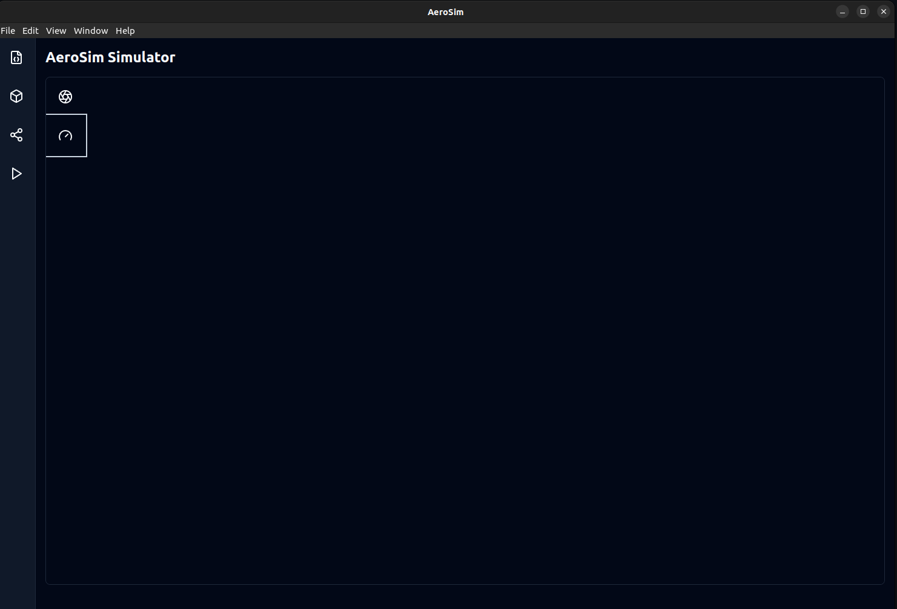
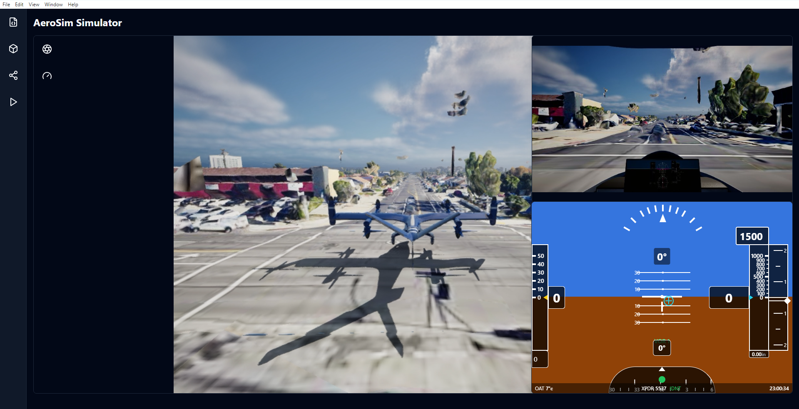
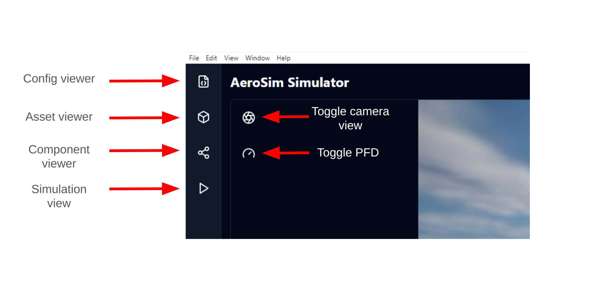

# AeroSim app

The AeroSim App is a companion interface to the AeroSim simulator useful for monitoring and interacting with AeroSim simulations. To use the app, ensure that you have the *aerosim-app* repository cloned, it should have been cloned when running the `install_aerosim.sh/bat` script. Enter the *aerosim-app* repository directory and then run:

```sh
bun install
```

Once the installation has completed, launch the app with the following command from the same :

```
bun run dev
```

You will now see the AeroSim app interface:



Now launch the AeroSim simulator with the following command:

```sh
# Windows launch_aerosim.bat --unreal-editor --pixel-streaming
./launch_aerosim.sh --unreal-editor --pixel-streaming
```

In the Unreal Engine interface, add a *Google Photorealistic 3D Tiles* asset and choose *Stream level Editor* from the *Pixel Steaming* dropdown menu.


Start the simulator in the Unreal Editor using the green play control. Open a separate terminal in the *aerosim* repository, source the AeroSim virtual environment and then enter the `examples/` directory and run the `autopilot_daa_scenario.py` script:

```sh
source .venv/bin/activate
cd tutorials/
# Windows .\.venv\Scripts\activate
# Windows cd .\tutorials\

python autopilot_daa_scenario.py
```

Press the *play* symbol on the left hand side of the app to see the ongoing simulation in the app:



You can toggle the Pilot Flight Display (PFD) with the instrument icon and the camera view with the camera aperture icon in the top left of the screen:


