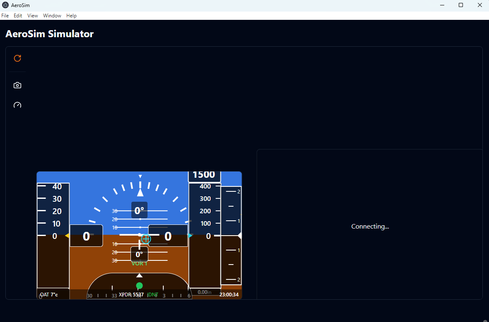
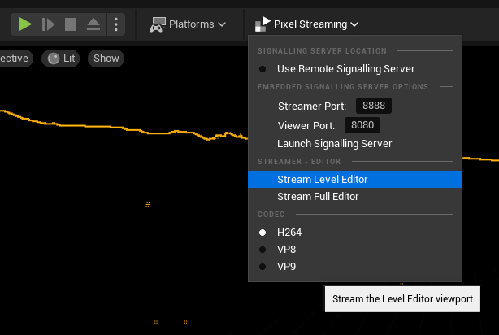

# AeroSim app

The [AeroSim App](https://github.com/aerosim-open/aerosim-app) is a companion interface to the AeroSim simulator useful for monitoring and interacting with AeroSim simulations. It allows the user to visualize the viewport of the simulation, view additional streaming cameras, receive the flight data information through the builtin Primary Flight Display (PFD) and control the simulation in some scripts using either the keyboard or a gamepad.

## Table of Contents
1. [Launching the app](#launching-the-app)
2. [Control the simulation](#control-the-simulation)
    - [first_flight.py](#first_flightpy)
    - [autopilot_daa_scenario.py](#autopilot_daa_scenariopy)
    - [pilot_control_with_flight_deck.py](#pilot_control_with_flight_deckpy)
3. [PFD Components](#pfd-components)
4. [Running the app independently](#running-the-app-independently)

## Launching the app

The app is downloaded and installed when running the `install_aerosim.sh/bat` script, ensure that you have the [_aerosim-app_ repository](https://github.com/aerosim-open/aerosim-app) cloned.

To visualize and control a simulation through the app, just launch AeroSim enabling the Pixel Streaming, to allow to stream viewport images from the renderer:

- Linux:
```sh
./launch_aerosim.sh --unreal-editor --pixel-streaming
```

- Windows:
```sh
launch_aerosim.bat --unreal-editor --pixel-streaming
```

In this example we will use Unreal Editor, but the steps with Omniverse are the same replacing the renderer with `--omniverse`.

You will now see the AeroSim app interface:



In the Unreal Engine interface, add a *Google Photorealistic 3D Tiles* asset to enable the Cesium tiles. To enable viewport streaming to the app, choose *Stream level Editor* from the *Pixel Steaming* dropdown menu at the top bar of the editor.



Start the simulator in the Unreal Editor using the green play control. Open a separate terminal in the *aerosim* repository, source the AeroSim virtual environment and then enter the `examples/` directory and run a script. In this example we will run the `autopilot_daa_scenario.py`:

- Linux:
```sh
source .venv/bin/activate
cd examples/
python autopilot_daa_scenario.py
```

- Windows:
```sh
.\.venv\Scripts\activate
cd examples\
python autopilot_daa_scenario.py
```

Once the python script is running, press the *reload* symbol on the top left hand side of the app to reload its state and see the ongoing simulation in the app:


You can toggle the *Pilot Flight Display (PFD)* with the instrument icon and the *camera view* with the camera icon in the top left of the screen:


You can drag and resize them to set them in the preferred configuration.

The camera will display images streamed from sensors spawned in the configuration file of the running script. Note that the camera images will only be visible if the `capture_enabled` is set to true for the camera sensor in the correspondent config file.

## Control the simulation

There are some AeroSim scripts which allow to manually control the simulation through the app, either using keyboard or gamepad:

- [first_flight.py](https://github.com/aerosim-open/aerosim/blob/main/examples/first_flight.py)
- [autopilot_daa_scenario.py](https://github.com/aerosim-open/aerosim/blob/main/examples/autopilot_daa_scenario.py)
- [pilot_control_with_flight_deck.py](https://github.com/aerosim-open/aerosim/blob/main/examples/pilot_control_with_flight_deck.py).

The specific controls are described here for each case. Refer to these scripts for further information.

### [first_flight.py](https://github.com/aerosim-open/aerosim/blob/main/examples/first_flight.py)

This is a simplified example that shows the core functionality of an AeroSim simulation. The airplane will take off under autopilot control, but with the AeroSim App window active you can use the keyboard to adjust the autopilot setpoints:
- `Up arrow` key increases airspeed setpoint (non-zero setpoint sets throttle to 100%)
- `Down arrow` key decreases airspeed setpoint (zero setpoint sets throttle to 0%)
- `W` key increases altitude setpoint (ascend)
- `S` key decreases altitude setpoint (descend)
- `A` key decreases heading setpoint (turn left)
- `D` key increases heading setpoint (turn right)

### [autopilot_daa_scenario.py](https://github.com/aerosim-open/aerosim/blob/main/examples/autopilot_daa_scenario.py)

In the autopilot DAA (Detect and Avoid) example, the EVTOL aircraft will take off and follow a set of waypoints under autopilot control.

During the flight, an intruder airplane will fly towards the EVTOL aircraft to simulate a potential DAA situation. With the AeroSim App window active you can take manual control to avoid a collision by using a gamepad (such as an Xbox controller):
        
- `B` button activates manual control
- In hover mode (low speed):
    - Left stick controls yaw and altitude
    - Right stick controls forward speed and lateral speed  
- In forward flight mode (high speed):
    - Left stick controls pitch and yaw
    - Right stick controls forward speed and roll

### [pilot_control_with_flight_deck.py](https://github.com/aerosim-open/aerosim/blob/main/examples/pilot_control_with_flight_deck.py)

This example demonstrates how to run a simulation to fly an airplane with a
flight deck.

Enter `1`, `2`, or `3` in the terminal to choose the control mode from the options listed above. Use keyboard or gamepad inputs with the AeroSim App window active:

1. For mode `1` using a gamepad (such as an Xbox controller):
    - `Y` button increases power (sets throttle to 100%)
    - `A` button decreases power (sets throttle to 0%)
    - Left stick controls roll and pitch
    - Right stick controls yaw

2. For mode `2` using the keyboard:
    - `Up arrow` key increases airspeed setpoint (non-zero setpoint sets throttle to 100%)
    - `Down arrow` key decreases airspeed setpoint (zero setpoint sets throttle to 0%)
    - `W` key increases altitude setpoint (ascend)
    - `S` key decreases altitude setpoint (descend)
    - `A` key decreases heading setpoint (turn left)
    - `D` key increases heading setpoint (turn right)

3. For mode `3`, autopilot control automatically flies the flight plan waypoints specified in `example_flight_plan.json`. No keyboard/joystick control is employed.

## PFD Components

When running the simulation you will be able to see a small screen with some UI elements. This is the Primary Flight Display (PFD) that is useful gor giving the pilot information about the current flight situatiation.


1. Airspeed tape:

    - This is the tape visible at the left of the screen. This will show the pilot both the current airspeed value and the True Air Speed (TAS) value right at the bottom of the tape.

2. Altitude tape:
    - Same as the airspeed but will show the current altitude your flight is currently in. At the top you will see the altitude alert value and at the bottom you can see the barometer settings.

3. Bank Angle:
    - Located at the center of the screen and represented by squares displaced radially and a fixed triangle pointer. This shows the roll amount of the flight, this works in conjunction with the Pitch Ladder and the Artificial Horizon (Point 4).

4. Pitch ladder/Artificial Horizon:
    - Right under the bank angle. This shows the current pitch of the plane, between the values of 90 and -90. The artificial horizon is the 2 background colors that are used to simulate the horizon of the flight, the point where the 2 color meet always coincide with the pitch value of 0 in the pitch ladder.

5. Horizontal Situation Indicator (HSI):
    - This is the compass rose right below the pitch ladder, this is used to indicate the heading, VOR mode and deviation of the flight path.

## Running the app independently

When launching the AeroSim simulation, the AeroSim app starts automatically. However, it is possible to launch it independently of the simulation for testing. Here are the required steps.

1.  Ensure that [bun](https://bun.sh/) is installed:

    - Linux:
    ```
    curl -fsSL https://bun.sh/install | bash
    ```

    - Windows:
    ```
    powershell -c "irm bun.sh/install.ps1 | iex"
    ```

2. Clone this repository and set the terminal/console directory to the `aerosim-app` folder

3. Install the required dependencies (only the first time running the application):

```
bun install
```

4. Run the app:

```
bun run dev
```