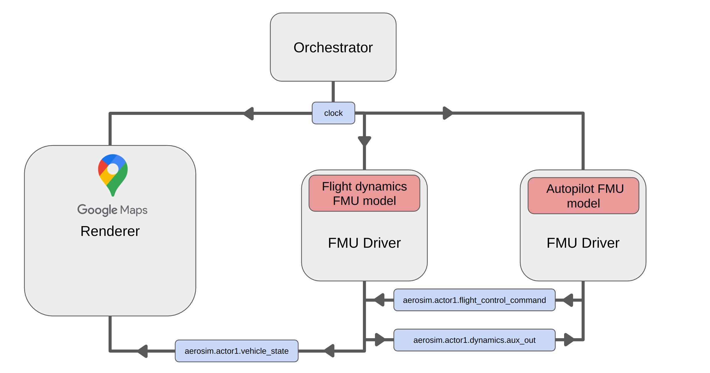

# Autopilot tutorial

This tutorial demonstrates how to set up a rudimentary autopilot FMU capable of following a set of waypoints, sending flight controls to a separate flight dynamics FMU.

In this tutorial you will learn to:

* Set up an example with multiple inter-communicating FMUs
* Set up a simple flight dynamics model with JSBSim encapsulated in an FMU
* Set up a rudimentary autopilot FMU to control the aircraft
<br>

---

* [__Set up the script and configuration__](#set-up-the-script-and-configuration)
* [__Set up the waypoint pattern__](#set-up-the-waypoint-pattern)
* [__Set up the flight dynamics FMU__](#set-up-the-flight-dynamics-fmu)
    - [Imports](#imports)
    - [Variables](#declare-the-fmu-variables-and-parameters)
    - [Convert parameters](#convert-jsbsim-parameters-into-vehiclestate-variables)
    - [Initialize the dynamics FMU](#initialize-the-aircraft-dynamics-fmu)
    - [Implement the FMU step](#implement-the-autopilot-fmu-step-procedure)
    - [Build the FMU](#build-the-fmu)
    - [Set up the FMU configuration](#set-up-the-flight-dynamics-fmu-configuration)
* [__Set up the autopilot FMU__](#set-up-the-autopilot-fmu)
    - [Imports](#imports)
    - [Variables](#declare-the-fmu-variables-and-parameters)
    - [Initialize the autopilot FMU](#initialize-the-autopilot-fmu)
    - [Implement utility functions](#implement-utility-functions)
    - [Implement the autopilot step procedure](#implement-the-autopilot-fmu-step-procedure)
    - [Build the FMU](#build-the-autopilot-fmu)
    - [Set up the FMU configuration](#set-up-the-autopilot-fmu-configuration)
* [__Configuration file__](#configuration-file)
* [__Run the script__](#run-the-script)

---

## Set up the script and configuration

Open a new Python file named `run_airport_tutorial.py` to launch the simulation:

```py
from aerosim import AeroSim

json_config_file = "sim_config_autopilot_tutorial.json"

aerosim = AeroSim()
aerosim.run(json_config_file)

try:
    input("Simulation is running. Press any key to stop...")
except KeyboardInterrupt:
    print("Simulation stopped.")
finally:
    aerosim.stop()
```

Open a JSON file named `sim_config_autopilot_tutorial.json` for the configuration and add the skeleton structure:

```json

{
    "description": "Autopilot tutorial.",
    "clock": {
        "step_size_ms": 20,
        "pace_1x_scale": true
    },
    "orchestrator": {
        "sync_topics": []
    },
    "world": {
        "update_interval_ms": 20,
        "origin": {
                     "latitude": 0.0,
                     "longitude": 0.0,
                     "altitude": 0.0
                 },
        "actors": [],
        "sensor_setup": []
    },
    "renderers": [
        {
            "renderer_id": "0",
            "role": "primary",
            "sensors": []
        }
    ],
    "fmu_models": []
}

```

---

## Set up the waypoint pattern

Choose an airport to start your flight simulation following the [instructions in the Takeoff Tutorial](takeoff_tutorial.md#choose-an-airport) and set the `origin` field of the `world` item in the configuration file accordingly:

```json

    ...

    "world": {
        "origin": {
            "latitude": 41.293357,
            "longitude": 2.067602,
            "altitude": 0.0
        },

    ...

```

Now, choose a pattern of waypoints using Google maps spaced at least 1km apart. Record the latitude and longitude of each waypoint and place them in a JSON file in a folder in the `tutorials` folder in the AeroSim repository:

```json
[
    {
    "lat": 41.297261,
    "lon": 2.079001
    },
    {
    "lat": 41.293417,
    "lon": 2.087278
    },
    {
    "lat": 41.286661,
    "lon": 2.090219
    },

    ...

]
```

For this example, we will name this JSON file `bcn_airport.json`.

---

## Set up the flight dynamics FMU

Now we will create the flight dynamics FMU. Open a new Python file in a folder named `fmu` in the `tutorials` folder.

### Imports

Import the necessary utility libraries and libraries from AeroSim.

```py
from aerosim_core import (
    feet_to_meters,
    register_fmu3_var,
    register_fmu3_param,
    lla_to_ned,
)

from aerosim_data import types as aerosim_types
from aerosim_data import dict_to_namespace

import os
import numpy as np
import math
import jsbsim
from scipy.spatial.transform import Rotation

from pythonfmu3 import Fmi3Slave
```

### Declare the FMU variables and parameters

We need to declare a number of variables for the FMU to communicate to other components of AeroSim:

* A [VehicleState](messages.md#vehiclestate) output variable to communicate vehicle position and pose to the renderer
* A [FlightControlCommand](messages.md#flightcontrolcommand) input variable to receive control commands from the autopilot FMU
* Several custom variables to send instrument data back to the autopilot FMU:
    * `vcal_knts`: calibrated speed in knots
    * `agl_ft`: altitude above ground level in feet
    * `roll_rad`: roll angle in radians
    * `pitch_rad`: pitch angle in radians
    * `psi_rad`: heading angle in radians
    * `lat`: current latitude of the aircraft
    * `lon`: current longitude of the aircraft

```py

...

class dynamics_fmu(Fmi3Slave):
    def __init__(self, **kwargs):
        super().__init__(**kwargs)

        self.jsbsim = None

        self.orig_lat = 0.0
        self.orig_lon = 0.0
        self.init_heading = 0

        register_fmu3_param(self, "orig_lat")
        register_fmu3_param(self, "orig_lon")
        register_fmu3_param(self, "init_heading")

        self.jsbsim_root_dir = ""
        self.jsbsim_script = "c172"

        # FMU variables to feed back to the autopilot
        self.vcal_knts = 0.0
        self.agl_ft = 0.0
        self.roll_rad = 0.0
        self.pitch_rad = 0.0
        self.psi_rad = 0.0
        self.lat = 0.0
        self.lon = 0.0

        register_fmu3_var(self, "vcal_knts", causality="output")
        register_fmu3_var(self, "agl_ft", causality="output")
        register_fmu3_var(self, "roll_rad", causality="output")
        register_fmu3_var(self, "pitch_rad", causality="output")
        register_fmu3_var(self, "psi_rad", causality="output")
        register_fmu3_var(self, "lat", causality="output")
        register_fmu3_var(self, "lon", causality="output")

        # FMU 3.0 requires a time variable set with independent causality
        self.time = 0.0
        register_fmu3_var(self, "time", causality="independent")

        # Define Aerosim interface output variables
        # VehicleState
        self.vehicle_state = dict_to_namespace(aerosim_types.VehicleState().to_dict())
        register_fmu3_var(self, "vehicle_state", causality="output")

        # Define AeroSim interface input variables
        # FlightControlCommand
        self.flight_control_command = dict_to_namespace(
            aerosim_types.FlightControlCommand().to_dict()
        )
        self.flight_control_command.power_cmd = np.array([0.0])
        register_fmu3_var(self, "flight_control_command", causality="input")

...
```

### Convert JSBSim parameters into VehicleState variables

We need a function to convert the JSBSim flight parameters into position, post and motion parameters for the renderer and update the `vehicle_state` output variable:

```py

    ...

    def set_outputs_to_aerosim(self):
        if self.jsbsim is None:
            return

        ned = lla_to_ned(
            self.jsbsim["position/lat-geod-deg"],
            self.jsbsim["position/long-gc-deg"],
            self.jsbsim["position/h-sl-meters"],
            self.orig_lat,
            self.orig_lon,
            0.0,  # Use zero altitude as the origin for NED frame
            # to output height as h-sl-meters
        )

        self.vehicle_state.state.pose.position.x = ned[0]
        self.vehicle_state.state.pose.position.y = ned[1]
        self.vehicle_state.state.pose.position.z = ned[2]

        roll = self.jsbsim["attitude/phi-rad"]
        pitch = self.jsbsim["attitude/theta-rad"]
        yaw = self.jsbsim["attitude/psi-rad"]
        two_pi = 2.0 * math.pi
        yaw = (yaw + two_pi) % two_pi  # Convert to 0-2pi range

        rotation = Rotation.from_euler("zyx", [roll, pitch, yaw])
        q_w, q_x, q_y, q_z = rotation.as_quat(scalar_first=True)
        self.vehicle_state.state.pose.orientation.w = q_w
        self.vehicle_state.state.pose.orientation.x = q_x
        self.vehicle_state.state.pose.orientation.y = q_y
        self.vehicle_state.state.pose.orientation.z = q_z

        self.vehicle_state.velocity.x = feet_to_meters(self.jsbsim["velocities/u-fps"])
        self.vehicle_state.velocity.y = feet_to_meters(self.jsbsim["velocities/v-fps"])
        self.vehicle_state.velocity.z = feet_to_meters(self.jsbsim["velocities/w-fps"])

        self.vehicle_state.angular_velocity.x = self.jsbsim["velocities/p-rad_sec"]
        self.vehicle_state.angular_velocity.y = self.jsbsim["velocities/q-rad_sec"]
        self.vehicle_state.angular_velocity.z = self.jsbsim["velocities/r-rad_sec"]

        self.vehicle_state.acceleration.x = feet_to_meters(
            self.jsbsim["accelerations/udot-ft_sec2"]
        )
        self.vehicle_state.acceleration.y = feet_to_meters(
            self.jsbsim["accelerations/vdot-ft_sec2"]
        )
        self.vehicle_state.acceleration.z = feet_to_meters(
            self.jsbsim["accelerations/wdot-ft_sec2"]
        )

        self.vehicle_state.angular_acceleration.x = self.jsbsim[
            "accelerations/pdot-rad_sec2"
        ]
        self.vehicle_state.angular_acceleration.y = self.jsbsim[
            "accelerations/qdot-rad_sec2"
        ]
        self.vehicle_state.angular_acceleration.z = self.jsbsim[
            "accelerations/rdot-rad_sec2"
        ]

        ...
```

### Initialize the aircraft dynamics FMU

In the initialization method, we need to set up the aircraft's initial position on the runway with the correct latitude, longitude and heading. We also need to start the engine and configure the aircraft model for takeoff.

```py

    ...

    def enter_initialization_mode(self):

        # Initialize the JSBSim Cessna 172R model
        self.jsbsim = jsbsim.FGFDMExec(jsbsim.get_default_root_dir());
        self.jsbsim.load_model('c172r')

        self.jsbsim['ic/h-sl-ft'] = 0      # Initial altitude (Sea Level)
        self.jsbsim['ic/u-fps'] = 0        # Initial velocity (Stationary)
        self.jsbsim['ic/vc-rad_sec'] = 0   # No initial pitch rotation

        self.jsbsim['ic/h-agl-ft'] = 4.43 # Height of COM with wheels on the ground

        self.jsbsim['ic/lat-geod-deg'] = self.orig_lat  # Approximate latitude
        self.jsbsim['ic/long-gc-deg'] = self.orig_lon  # Approximate longitude
        self.jsbsim['ic/psi-true-deg'] = self.init_heading  # Facing East
        self.jsbsim['ic/gamma-deg'] = 0     # No initial climb angle
        self.jsbsim.run_ic()  # Apply initial conditions

        # Start the engine
        self.jsbsim[f"fcs/mixture-cmd-norm"] = 1.0
        self.jsbsim[f"fcs/advance-cmd-norm"] = 1.0
        self.jsbsim[f"propulsion/magneto_cmd"] = 3
        self.jsbsim[f"propulsion/starter_cmd"] = 1

        # Release the brakes and set flaps for takeoff
        self.jsbsim["fcs/center-brake-cmd-norm"] = 0
        self.jsbsim["fcs/left-brake-cmd-norm"] = 0
        self.jsbsim["fcs/right-brake-cmd-norm"] = 0
        self.jsbsim["fcs/flap-pos-deg"] = 25


    def exit_initialization_mode(self):
        pass

    ...

```

### Implement the FMU step procedure

In the `do_step(...)` function, we update JSBSim with control commands received from the autopilot FMU, then execute a JSBSim simulation step and lastly update the FMU output variables with new flight parameters from JSBSim.

```py

    ...

    def do_step(self, current_time: float, step_size: float) -> bool:

        self.time = self.jsbsim.get_sim_time()

        # Set the flight controls from the incoming FlightControlCommand message
        self.jsbsim['fcs/throttle-cmd-norm'] = self.flight_control_command.power_cmd
        self.jsbsim['fcs/aileron-cmd-norm'] = self.flight_control_command.roll_cmd
        self.jsbsim['fcs/elevator-cmd-norm'] = self.flight_control_command.pitch_cmd
        self.jsbsim['fcs/flap-pos-deg'] = self.flight_control_command.flap_cmd * 25

        # Step JSBSim
        self.jsbsim.run()

        # Update the FMU output variables with the new position, attitude and speed
        self.vcal_knts = self.jsbsim['velocities/vc-kts']
        self.agl_ft = self.jsbsim['position/h-agl-ft']
        self.roll_rad = self.jsbsim['attitude/roll-rad']
        self.pitch_rad = self.jsbsim['attitude/pitch-rad']
        self.psi_rad = self.jsbsim['attitude/psi-rad']
        self.lat = self.jsbsim['position/lat-geod-deg']
        self.lon = self.jsbsim['position/long-gc-deg']

        # Translate the JSBSim data to the AeroSim VehicleState type for the renderer
        self.set_outputs_to_aerosim()

        return True

```

### Build the FMU

In the `fmu` folder, run the PythonFMU3 build command:

```sh
pythonfmu3 build -f dynamics.py
```

This will create a file named `dynamics_fmu.fmu` in the same folder.

### Set up the flight dynamics FMU configuration

In the simulation configuration file, add an item to the `fmu_models` section. We set the output topics to publish the vehicle state, and we set the input topics to subscribe to a topic with the [FlightControlCommand](messages.md#flightcontrolcommand) message structure. Since we have some additional parameters to exchange between the FMUs that do not conform to an existing AeroSim datatype, we use the `fmu_aux_output_mapping` field to broadcast a custom topic containing those parameters.

```json

    ...

    "fmu_models": [
        {
            "id": "dynamics_fmu",
            "fmu_model_path": "fmu/dynamics_fmu.fmu",
            "component_input_topics": [
                {
                    "msg_type": "flight_control_command",
                    "topic": "aerosim.actor1.flight_control_command"
                }
            ],
            "component_output_topics": [
                {
                    "msg_type": "vehicle_state",
                    "topic": "aerosim.actor1.vehicle_state"
                }
            ],
            "fmu_aux_input_mapping": {},
            "fmu_aux_output_mapping": {
                "aerosim.actor1.dynamics.aux_out": {
                    "vcal_knts": "vcal_knts",
                    "agl_ft": "agl_ft",
                    "roll_rad": "roll_rad",
                    "pitch_rad": "pitch_rad",
                    "psi_rad": "psi_rad",
                    "lat": "lat",
                    "lon": "lon"
                }
            },
            "fmu_initial_vals": {
                "orig_lat": 41.293222,
                "orig_lon": 2.067261,
                "init_heading": 67
            }
        },

        ...

    ]
```

---

## Set up the autopilot FMU

Next, we will set up a separate FMU for a rudimentary autopilot FMU, capable of maintaining a set altitude and speed and following the waypoints. In the `fmu` folder, open a new Python file named `autopilot_fmu.py`.

### Imports

Import the necessary utility libraries and libraries from AeroSim.

```py
from aerosim_core import (
    feet_to_meters,
    register_fmu3_var,
    register_fmu3_param,
    haversine_distance_meters,
    lla_to_ned,
)

from aerosim_data import types as aerosim_types
from aerosim_data import dict_to_namespace

import os
import json
import math
import jsbsim
import numpy as np
from scipy.spatial.transform import Rotation

from pythonfmu3 import Fmi3Slave

...

```

### Declare the FMU variables and parameters

We need to declare a number of variables for the FMU to communicate to other components of AeroSim:

* A [FlightControlCommand](messages.md#flightcontrolcommand) output variable to send control commands from the flight dynamics FMU
* Several custom variables to receive flight data from the flight dynamics FMU:
    * `vcal_knts`: calibrated speed in knots
    * `agl_ft`: altitude above ground level in feet
    * `roll_rad`: roll angle in radians
    * `pitch_rad`: pitch angle in radians
    * `psi_rad`: heading angle in radians
    * `lat`: current latitude of the aircraft
    * `lon`: current longitude of the aircraft
* Variables to identify the location of the waypoints JSON file

```py

...

class autopilot_fmu(Fmi3Slave):
    def __init__(self, **kwargs):
        super().__init__(**kwargs)

        # Variables and filepaths for waypoints
        self.waypoints = None
        self.waypoints_dir = ''
        self.waypoints_file = ''
        self.current_waypoint = None

        register_fmu3_param(self, "waypoints_dir")
        register_fmu3_param(self, "waypoints_file")

        # Variables received from the flight dynamics FMU
        self.vcal_knts = 0.0
        self.agl_ft = 0.0
        self.roll_rad = 0.0
        self.pitch_rad = 0.0
        self.psi_rad = 0.0
        self.lat = 0.0
        self.lon = 0.0

        register_fmu3_var(self, "vcal_knts", causality="input")
        register_fmu3_var(self, "agl_ft", causality="input")
        register_fmu3_var(self, "roll_rad", causality="input")
        register_fmu3_var(self, "pitch_rad", causality="input")
        register_fmu3_var(self, "psi_rad", causality="input")
        register_fmu3_var(self, "lat", causality="input")
        register_fmu3_var(self, "lon", causality="input")

        self.is_airbourne = False

        # FMU 3.0 requires a time variable set with independent causality
        self.time = 0.0
        register_fmu3_var(self, "time", causality="independent")

        # AeroSim FlightControlCommand structure to send to the dynamics FMU
        self.flight_control_command = dict_to_namespace(
            aerosim_types.FlightControlCommand().to_dict()
        )
        self.flight_control_command.power_cmd = np.array([0.0])
        register_fmu3_var(self, "flight_control_command", causality="output")

...

```

### Initialize the autopilot FMU

On initialization we need to load the waypoints JSON file and check for errors.

```py

    ...

    def enter_initialization_mode(self):

        # Load the JSON with the flight waypoints

        try:
            file_path = os.path.join(self.waypoints_dir, self.waypoints_file)
            with open(file_path, 'r', encoding='utf-8') as file:
                json_waypoints = json.load(file)
                json_waypoints.reverse()
                self.waypoints = json_waypoints
        except FileNotFoundError:
            print(f"Error: The file '{file_path}' was not found.")
        except json.JSONDecodeError:
            print(f"Error: The file '{file_path}' contains invalid JSON.")
        except Exception as e:
            print(f"An unexpected error occurred: {e}")

        if self.waypoints is not None:
            if len(self.waypoints) > 0:
                self.current_waypoint = self.waypoints.pop()

    ...

```

### Implement utility functions

The autopilot needs utility functions to hold the altitude and calculate a bearing to a given waypoint:

```py

    ...

    def hold_altitude(self, target_altitude, target_speed):

        # Control elevator and throttle to control altitude and speed

        # PID Controller Parameters
        Kp = 0.005  # Proportional gain
        Kp_throttle = 0.01  # Proportional gain

        current_altitude = self.agl_ft
        current_speed = self.vcal_knts

        # Compute altitude error
        altitude_error = target_altitude - current_altitude

        # Adjust elevator
        elevator_command = Kp * altitude_error
        elevator_command = max(-0.1, min(0.1, elevator_command))
        self.flight_control_command.pitch_cmd = - elevator_command

        # Adjust throttle based on airspeed
        speed_error = target_speed - current_speed
        throttle_command = 0.75 + Kp_throttle * speed_error  # Base throttle + correction
        throttle_command = max(0, min(1, throttle_command))  # Limit between 0 and 1
        self.flight_control_command.power_cmd = np.array([throttle_command])

    def calculate_bearing(self, lat, lon):

        # Calculate bearing and distance to waypoint

        lat1, lon1, lat2, lon2 = map(math.radians, [self.lat, self.lon, lat, lon])
        delta_lon = lon2 - lon1
        x = math.sin(delta_lon) * math.cos(lat2)
        y = math.cos(lat1) * math.sin(lat2) - (math.sin(lat1) * math.cos(lat2) * math.cos(delta_lon))
        initial_bearing = math.atan2(x, y)
        distance = haversine_distance_meters(self.lat, self.lon, lat, lon,)
        return math.degrees(initial_bearing) % 360 , distance

    ...

```

### Implement the autopilot FMU step procedure

In the step procedure, the autopilot FMU will apply full power until a safe takeoff speed is reached and then apply elevator commands to raise the nose. After reaching 50 feet above ground level, the autopilot will retract the flaps, aim for a target altitude of 150 feet and target speed of 80 knots and apply course corrections to fly towards the next waypoint, if one is given. Once the aicraft is within 200 meters of a waypoint, it will turn to fly towards the next waypoint.

```py

    ...

def do_step(self, current_time: float, step_size: float) -> bool:

        print(f"Power: {self.flight_control_command.power_cmd[0]:.2f}, Vcal: {self.vcal_knts:.2f}, AGL: {self.agl_ft:.2f}, Roll: {self.roll_rad:.2f} ft")
        print("Airbourne: " + str(self.is_airbourne))

        self.flight_control_command.roll_cmd = - 5.0 * self.roll_rad

        if not self.is_airbourne:
            # The aircraft is on the runway, apply full throttle
            self.flight_control_command.power_cmd = np.array([1.0])
            # At a safe speed, let's rotate and lift the nose
            if self.vcal_knts > 65:
                self.flight_control_command.pitch_cmd = -0.3

            self.flight_control_command.roll_cmd = - 5.0 * self.roll_rad

            self.flight_control_command.flap_cmd = 1.0

        else:
            # Once airbourne, we retract the flaps and set a controller to
            # hold to aim for a height of 150 meters and a speed of 80 knots

            self.flight_control_command.flap_cmd = 0.0

            self.hold_altitude(self.target_altitude, self.target_speed)

            if self.current_waypoint is not None:
                
                # Let's calculate the target heading and distance to the waypoint from our current position
                target_heading, dist_to_waypoint = self.calculate_bearing(self.current_waypoint['lat'], self.current_waypoint['lon'])
                current_heading = math.degrees(self.psi_rad)

                # Now calculate the heading error
                heading_error = (target_heading - current_heading + 180) % 360 - 180

                print(f"Target heading: {target_heading:.2f} Current heading: {current_heading:.2f} distance to waypoint: {dist_to_waypoint:.2f}")

                if heading_error > 0:
                    # Turn right
                    correction = 0.3 * min(abs(heading_error), 20)/20 
                    self.flight_control_command.roll_cmd = - 5.0 * (self.roll_rad - correction)
                else:
                    # Turn left
                    correction = 0.3 * min(abs(heading_error), 20)/20 
                    self.flight_control_command.roll_cmd = - 5.0 * (self.roll_rad + correction)

                if dist_to_waypoint < 200:
                    if len(self.waypoints) > 0:
                        self.current_waypoint = self.waypoints.pop()
                    else:
                        self.current_waypoint = None

            else:
                # Keep the wings level
                self.flight_control_command.roll_cmd = - 5.0 * self.roll_rad

        if self.agl_ft > 50:
            self.is_airbourne = True

        return True
        

```

### Build the autopilot FMU

In the `fmu` folder, run the PythonFMU3 build command:

```sh
pythonfmu3 build -f autopilot_fmu.py
```

This will create a file named `autopilot_fmu.fmu` in the same folder.

### Set up the autopilot FMU configuration

In the simulation configuration file, add an item to the `fmu_models` section. We set an output topic with the [FlightControlCommand](messages.md#flightcontrolcommand) message from the autopilot. Since we have some parameters that we want to communicate between the two FMUs that don't conform to an existing AeroSim type, we use the `fmu_aux_input_mapping` field to subscribe to a custom topic and message structure.

```json

    "fmu_models": [

        ...

        {
            "id": "autopilot_fmu",
            "fmu_model_path": "fmu/autopilot_fmu.fmu",
            "component_input_topics": [],
            "component_output_topics": [
                {
                    "msg_type": "flight_control_command",
                    "topic": "aerosim.actor1.flight_control_command"
                }
            ],
            "fmu_aux_input_mapping": {
                "aerosim.actor1.dynamics.aux_out": {
                    "vcal_knts": "vcal_knts",
                    "agl_ft": "agl_ft",
                    "roll_rad": "roll_rad",
                    "pitch_rad": "pitch_rad",
                    "psi_rad": "psi_rad",
                    "lat": "lat",
                    "lon": "lon"
                }
            },
            "fmu_aux_output_mapping": {},
            "fmu_initial_vals": {
                "waypoints_dir": "waypoints",
                "waypoints_file": "bcn_airport.json"
            }
        }
    ]

    ...

```

---

## Configuration file

Set up the `generic_aircraft` model in the configuration file and set the origin with the latitude, longitude and appropriate altitude for the beggining of the chosen runway. Set up the propeller effector to add the propeller to the render. Set up the FMU model configuration as shown in the previous sections for the [flight dynamics FMU](#set-up-the-flight-dynamics-fmu) and the [autopilot FMU](#set-up-the-autopilot-fmu).



```json

{
    "description": "Simple autopilot tutorial.",
    "clock": {
        "step_size_ms": 20,
        "pace_1x_scale": true
    },
    "orchestrator": {
        "sync_topics": [
            {
                "topic": "aerosim.actor1.vehicle_state",
                "interval_ms": 20
            }
        ]
    },
    "world": {
        "update_interval_ms": 20,
        "origin": {
            "latitude": 41.293222,
            "longitude": 2.067261,
            "altitude": 51
        },
        "weather": {
            "preset": "Cloudy"
        },
        "actors": [
            {
                "actor_name": "actor1",
                "actor_asset": "vehicles/generic_airplane/generic_airplane",
                "parent": "",
                "description": "Generic aircraft model",
                "transform": {
                    "position": [0.0,0.0,0.0],
                    "rotation": [0.0,0.0,66.5],
                    "scale": [1.0,1.0,1.0]
                },
                "state": {
                    "msg_type": "aerosim::types::VehicleState",
                    "topic": "aerosim.actor1.vehicle_state"
                },
                "effectors": [
                    {
                        "id": "propeller_front",
                        "relative_path": "generic_airplane/propeller",
                        "transform": {
                            "translation": [0.0,0.0,0.0],
                            "rotation": [0.0,0.0,0.0],
                            "scale": [1.0,1.0,1.0]
                        },
                        "state": {
                            "msg_type": "aerosim::types::EffectorState",
                            "topic": "aerosim.actor1.propeller.effector_state"
                        }
                    }
                ]
            }
        ],
        "sensors": [
                {
                    "sensor_name": "rgb_camera_0",
                    "type": "sensors/cameras/rgb_camera",
                    "parent": "actor1",
                    "transform": {
                        "translation": [-20.0,0.0,-5.0],
                        "rotation": [0.0,-10.0,0.0]
                    },
                    "parameters": {
                        "resolution": [
                            1920,
                            1080
                        ],
                        "tick_rate": 0.02,
                        "frame_rate": 30,
                        "fov": 90,
                        "near_clip": 0.1,
                        "far_clip": 1000.0,
                        "capture_enabled": false
                    }
                }
            ]
    }
    "fmu_models": [
        ...
    ]
}

```

---

## Run the script

Now ensure that you activate the AeroSim virtual environment and then from the tutorials directory run the Python script to execute the simulation:

```sh
source .venv/bin/activate
cd tutorials/
# Windows .\.venv\Scripts\activate
# Windows cd .\tutorials\

python run_autopilot_tutorial.py

