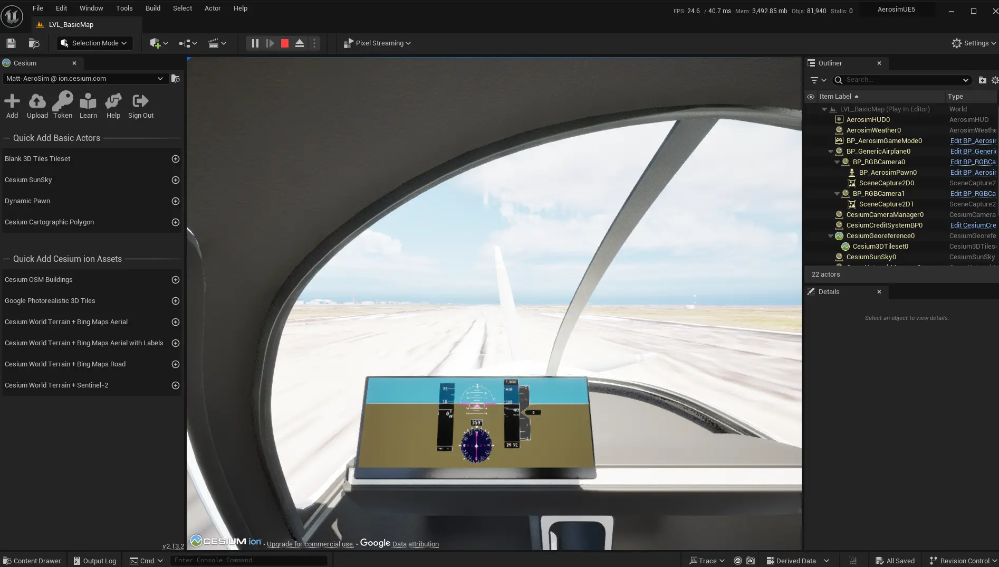

# AeroSim Windows installation

This guide demonstrates how to setup and build AeroSim in __Windows 11__.

* [__Set up accounts__](#set-up-accounts)
* [__Install Visual Studio toolchain__](#install-visual-studio-toolchain)
* [__Install and set up WSL2__](#install-and-set-up-wsl2)
* [__Using Unreal as a renderer__](#using-unreal-as-a-renderer)
* [__Set up Cesium token__](#set-up-cesium-token)
* [__Install and build AeroSim__](#install-and-build-aerosim)
* [__Verify installation__](#verify-installation)

## Set up accounts

Before you start, you should set up the necessary accounts needed to gain access to assets needed by AeroSim:

* [__GitHub__](https://github.com/signup): AeroSim is hosted on GitHub
* [__Epic Games__](https://www.epicgames.com/id/register/date-of-birth): To use Unreal as a renderer for AeroSim, an Epic account is required download an Unreal Engine 5.3 installed-build or build from source
* [__NVIDIA__](https://developer.nvidia.com/omniverse#section-getting-started): To use Omniverse Kit as a renderer for AeroSim, an AeroSim Omniverse Kit 105.1 App example is provided through the AeroSim installation process but in order to access the full Omniverse ecosystem or do Kit app development, an NVIDIA developer account is required
* [__Cesium__](https://ion.cesium.com/signup/): AeroSim uses 3D map tile assets from Cesium

In order to authorise the download of the Unreal Engine 5.3 repository, you must link your GitHub account with Epic Games. Follow [this guide](https://www.unrealengine.com/en-US/ue-on-github) to link your accounts. You will need to provide your GitHub credentials (username and [token](https://docs.github.com/en/authentication/keeping-your-account-and-data-secure/managing-your-personal-access-tokens)) to authorise the download. You may also wish to [connect to GitHub through SSH](https://docs.github.com/en/authentication/connecting-to-github-with-ssh).

---

## Install Visual Studio toolchain

AeroSim requires Windows 10 or Windows 11 with the MSVC C++ compiler toolchain installed through Visual Studio 2022.

Follow the instructions to install Visual Studio 2022 here: https://visualstudio.microsoft.com/vs/

Select the `Desktop Development with C++` bundle. For using Unreal Engine 5.3, also select the `.NET Framework 4.6.2 SDK` individual component.

---

## Install and set up WSL2

AeroSim on Windows requires [WSL2](https://learn.microsoft.com/en-us/windows/wsl/install) to run the Apache Kafka server for the AeroSim middleware. Set up a WSL2 Ubuntu 22.04 distro:

```sh
# administrator-elevated command prompt
wsl --install -d Ubuntu-22.04
```

After the WSL2 Ubuntu environment is set up, enter into it and install Kafka's rerequisites by running:

```sh
# WSL2 terminal
sudo apt update
sudo apt install openjdk-21-jdk -y
```

The WSL2 networking mode should be set to **NAT** for best latency performance with AeroSim. To check it, open the `WSL Settings` application from the Start menu and look for the `Networking Mode` configuration in the `Networking` section.

---

## Using Unreal as a renderer

To use Unreal as a renderer, download Unreal Engine 5.3 or clone and build it from source, and then set a `AEROSIM_UNREAL_ENGINE_ROOT` environment variable to its location.

### Download Unreal Engine 5.3

Download Unreal Engine 5.3 using the Epic Games Launcher installed from [this link](https://www.unrealengine.com/en-US/download).
Alternatively, you can follow the instructions in the next section to build from source.

### Clone and build Unreal Engine 5.3 from source

In order to authorise the download of the Unreal Engine 5.3 repository, you must link your GitHub account with Epic Games. Follow [this guide](https://www.unrealengine.com/en-US/ue-on-github) to link your accounts. You will need to provide your GitHub credentials (username and [token](https://docs.github.com/en/authentication/keeping-your-account-and-data-secure/managing-your-personal-access-tokens)) to authorise the download. You may also wish to [authorize to GitHub through SSH](https://docs.github.com/en/authentication/connecting-to-github-with-ssh).

```sh
git clone -b 5.3 --depth=1 git@github.com:EpicGames/UnrealEngine.git
```

Move into the root folder of the Unreal Engine repository and run the setup scripts:

```sh
Setup.bat
GenerateProjectFiles.bat
```

Inside this source folder open the UE5.sln file in Visual Studio (double click). In the build bar ensure that you have selected `Development Editor`, `Win64` and `UnrealBuildTool` option.

Now build Unreal Engine 5.3, this process could take up to 3 hours.

### Set environment variable

Go to the *Environment Variables* section of the Windows Control Panel *Advanced System Settings* to create a `AEROSIM_UNREAL_ENGINE_ROOT` *User* environment variable with the *value* set to the root folder of the Unreal Engine 5.3 installation, or you can do it from a command prompt by running:

```sh
setx AEROSIM_UNREAL_ENGINE_ROOT "C:\Program Files\Epic Games\UE_5.3"
```

---

## Set up Cesium token

To access Cesium assets, you will need to set up an access token. Log in to your Cesium account and go to the *Access Tokens* tab. If you don't already have a token, click on *Create Token* and create a new token with the default settings. Copy the token to the clipboard.

Go to the *Environment Variables* section of the Windows Control Panel *Advanced System Settings* to create a `AEROSIM_CESIUM_TOKEN` *User* environment variable with the *value* set to the token copied in the step above, or you can do it from a command prompt by running:

```sh
setx AEROSIM_CESIUM_TOKEN {token}
```

---

## Install and build AeroSim

First, clone the main AeroSim repository:

```sh
git clone https://github.com/aerosim-open/aerosim.git
```

Once the repository is cloned, enter the root directory of the repository and run the `pre_install.bat` script to check and install the pre-requisites:

```sh
cd aerosim
pre_install.bat
```

After this is complete, run the `install_aerosim.bat` script to install AeroSim:

```sh
install_aerosim.bat
```

The install script will notify you of several environment variables that are set up for AeroSim to run. Restart the terminal to refresh the environment variables.

To build AeroSim, run:

```sh
build_aerosim.bat
```

Alternatively, you can run the following commands for more control over the steps and build options:

```sh
rye sync
.venv\Scripts\activate
rye run build
```

---

## Verify installation

Once AeroSim has been built successfully and the related environment variables are set, launch AeroSim with the launch script. Open a terminal in the repository root directory:

```sh
# For using Unreal rendering in native Editor mode
launch_aerosim.bat --unreal-editor

# For using Omniverse rendering in native Kit app mode
launch_aerosim.bat --omniverse
```

This should launch the AeroSim project in the Unreal Editor or Omniverse Kit app. Add a *Google Photorealistic 3D Tile* asset from the Cesium ion Assets menu (sign into Cesium ion if necessary) then press the green play control at the top of the Unreal Engine or Omniverse interface. This will start the renderer ready for a simulation.

Next, open a new terminal in the repository root directory and activate the AeroSim virtual environment, which has all the Python dependencies installed:

```sh
.venv\Scripts\activate
```

Then run the `first_flight.py` Python script from within the examples folder:

```sh
cd examples
python first_flight.py
```

In the Unreal Editor or Omniverse Kit app viewport you should see an interior view of an aircraft taking off from a runway:



If this example runs successfully, your installation has been successful!
