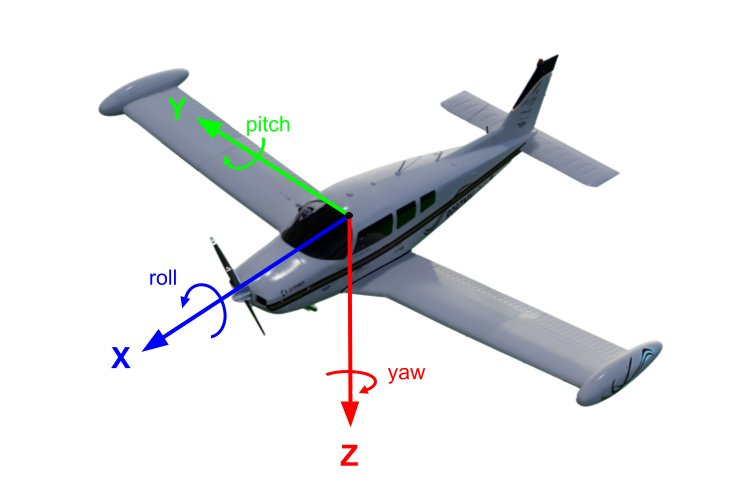

# Conventions

## Geocentric and geodetic coordinates

Latitude and longitude can be given in terms of geocentric coordinates or geodetic coordinates. The key difference is that geodetic coordinates account for the oblate shape of the Earth whereas geocentric coordinates presume a spherical Earth. Therefore the geocentric latitude and geodetic latitude of a fixed point on the Earth's surface differ everywhere except for on the Equator. Geocentric longitude geodetic longitude are always equal.

## Global coordinate frames and metrics

AeroSim uses several different methods of identifying position and orientation within the simulation. Data must be converted between frames of reference when passing data between different components. All coordinate systems used are right-handed.

- **North, East, Down (NED)**: AeroSim uses the NED local tangent plane (LTP) coordinate convention. The _Up_ direction is defined by the vector between the Earth's center of mass and a local point on its surface. The origin of the coordinate system moves with the Earth's surface, such that the origin is always tied to a specific latitude and longitude. This means that NED is locally Cartesian but globally non-Cartesian. Within the simulator the following correspondences apply:

      * __X__ -> __North__
      * __Y__ -> __East__
      * __Z__ -> __Down__

   

- **Latitude, Longitude, Altitude, (LLA)**: this is a non-Cartesian [geographic coordinate system](https://en.wikipedia.org/wiki/Geographic_coordinate_system) (or geodetic coordinate system) that most people are familiar with. This coordinate system defines a fixed point on the surface of the earth that moves with the earth's rotation, such that a defined LLA coordinate will allways be in the same place as seen from an observer standing on the Earth's surface.

- **Earth-centered, Earth-fixed, (ECEF)**: this is the geocentric coordinate system, a cartesian spatial reference system that represents locations in the vicinity of the Earth as X, Y and Z coordinates with the origin of the coordinate frame defined at the Earth's center of mass.

  - **Z-axis**: extends from the Earth's center of mass through the North pole.
  - **X-axis**: extends from the Earths center of mass through the intersection of the Prime Meridian (0&deg; longitude) and the Equator (0&deg; latitude)
  - **Y-axis**: extends from the Earths center of mass through the intersection of the 90&deg; longitude line and the Equator (0&deg; latitude)

## Local coordinate frames

The local coordinate system of actors (for example vehicles) follows the right handed convention with the front of the vehicle pointing along the positive X-axis, following the Front-Right-Down (FRD) convention:

The rotations used in the simulation configuration files use degrees and are applied as intrinsic rotations in the roll, pitch, yaw order. Internally, these are converted to a quaternion representation
