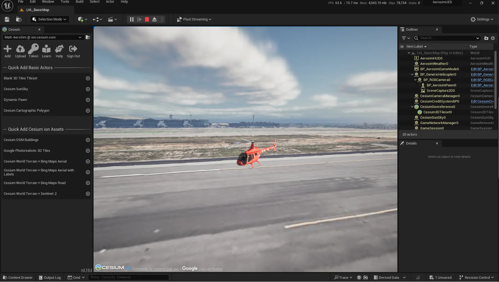

# First steps tutorial

This tutorial walks you through the first steps in AeroSim. In this tutorial you will learn:

* How to set up a simulator configuration and a Python run file
* How to load an environment in the configuration
* How to add a vehicle in the configuration
* How to set up an FMU to send state information to the simulator

The following tutorial outlines how to set up AeroSim to load a Cesium map tile, add a vehicle and move the vehicle in a simple way through an FMU. You can find all the code files described below in the `tutorials` folder of the AeroSim repository.

* [__Simulator configuration file__](#simulator-configuration-file)
    - [Orchestrator](#orchestrator-configuration)
    - [World](#world-configuration)
    - [FMU configuration](#fmu-model-configuration)

* [__Setting up the FMU__](#setting-up-the-fmu)

* [__Python launch script__](#python-launch-script)

---

## Simulator configuration file

Firstly, in the `tutorials` folder of the aerosim repository open a new JSON file in the `config` directory named `sim_config_first_steps_tutorial.json`. In the JSON file there are several fields to define:

* `"description"`: A simple description of your simulation configuration
* `"clock"`: Define the simulation time-step parameters
* `"orchestrator"`: A configuration for the orchestrator that coordinates AeroSim's modules
* `"world"`: The world configuration, containing information about the environment and actors
* `"fmu_models"`: The configuration for the FMU(s) driving control inputs and dynamics in your simulation

### Orchestrator configuration

First, define the time-step size of the simulation in milliseconds with the `step_size_ms` parameter in the `clock` field.

In the orchestrator field add the topics to be published by the orchestrator. In this case, we only need one, `aerosim.actor1.vehicle_state`. We will add two more, `aerosim.fmu_tutorial.input` and `aerosim.fmu_tutorial.output` as auxiliary topics, in case we need to pass other variables for experimentation or debugging purposes.

The `sync_topics` field defines the topics to which the orchestrator will synchronize. The orchestrator will wait to receive data back on all the topics defined in this field before initiating the next simulation time-step by sending another clock message.

```json
{
    "description": "First steps tutorial.",
    "clock": {
        "step_size_ms": 20,
        "pace_1x_scale": true
    },
    "orchestrator": {
        "sync_topics": [
            {
                "topic": "aerosim.actor1.vehicle_state",
                "interval_ms": 20
            }
        ]
    },

    ...

}
```

### World configuration

In the world field, we provide several details about how we want to configure the 3D simulation environment and the vehicles within it. The following fields are needed to configure the world object:

* `origin`: set a `latitude`, `longitude` and `altitude` in the `origin` field to define the starting point of the simulation. Cesium will download a tile from its database corresponding to this location.

* `weather`: weather setting for the simulation. Can be set to `Cloudy`, `ClearSky` or `FoggyAndCloudy`.

* `actors`: we define the list of actors we want to add to the simulation. In this case, we only want to add 1 actor, a helicopter model. Each actor must have an `id`, a `type` and a corresponding 3D model file.
    * `id`: an ID for each actor, this may be used elsewhere in the simulation to reference it
    * `type`: the actor type, for example, `aircraft` or `helicopter`
    * `transform`: this field applies an initial transform to the actor, useful to position static actors (it should be noted that further updates to the vehicle's state through will override this parameter)
    * `state`: this sets the state of the actor and the data topic that influences it. In this case we set the state to `dynamic` and the

* `sensor_setup`: in the sensor field, we will add a camera so that we can observe the simulation.


```json
{

    ...

    "world": {
        "update_interval_ms": 20,
        "origin": {
            "latitude": 33.936519,
            "longitude": -118.412698,
            "altitude": 0.0
        },
        "actors": [
            {
                "actor_name": "actor1",
                "actor_asset": "vehicles/generic_helicopter/generic_helicopter",
                "parent": "",
                "description": "Generic helicopter model",
                "transform": {
                    "position": [0.0,0.0,0.0],
                    "rotation": [0.0,0.0,66.5],
                    "scale": [1.0,1.0,1.0]
                },
                "state": {
                    "msg_type": "aerosim::types::VehicleState",
                    "topic": "aerosim.actor1.vehicle_state"
                },
                "effectors": []
            }
        ],
        "sensor_setup": [
            {
                "sensor_name": "rgb_camera_0",
                "type": "sensors/cameras/rgb_camera",
                "parent": "actor1",
                "transform": {
                    "translation": [17.0,-13.0,-5.0],
                    "rotation": [0.0,-10.0,140.0]
                },
                "parameters": {
                    "resolution": [
                        1920,
                        1080
                    ],
                    "tick_rate": 0.02,
                    "frame_rate": 30,
                    "fov": 90,
                    "near_clip": 0.1,
                    "far_clip": 1000.0,
                    "capture_enabled": false
                }
            }
        ]
    },

    ...

}
```

## FMU model configuration

The FMU models are the logic units that handle any business logic related to controling the simulator. For example, processing input from an external control device such as a joystick, processing input from a machine learning stack or executing a flight dynamics model. The FMU is driven by the FMU driver module. FMU inputs and outputs are handled through data topics either published or subscribed by the FMU driver through the data middleware.

The `fmu_models` field must contain a list of FMU configurations. Several FMUs can be used simultaneously and can be inter-connected, in addition to being connected to other components of AeroSim. There are several key fields to set up for each FMU configuration:

* `id`: an ID for the FMU, this can be used to reference the FMU elsewhere in the simulation
* `fmu_model_path`: the path to the `.fmu` model file. This is relative the the directory where the script in launched
* `component_input_topics`: the data topics that the FMU subscribes for input data
* `component_output_topics`: the data topics that the FMU uses to publish output data
* `msg_type`: the type governing the structure of the messages broadcast through a the component intput/output topics

* `fmu_aux_input_mapping`: manually enforce correspondence between FMU input variables and message attributes for the given topic
* `fmu_aux_output_mapping`: manually enforce correspondence between FMU output variables and message attributes for the given topic

* `fmu_init_vals`: values to initialize FMU input variables


```json
{

    ...

    "fmu_models": [
        {
            "id": "tutorial_fmu",
            "fmu_model_path": "fmu/first_steps_fmu.fmu",
            "component_input_topics": [],
            "component_output_topics": [
                {
                    "msg_type": "vehicle_state",
                    "topic": "aerosim.actor1.vehicle_state"
                }
            ],
            "fmu_aux_input_mapping": {
                "aerosim.fmu_tutorial.input": {
                    "custom_input_topic_var": "custom_fmu_input"
                }
            },
            "fmu_aux_output_mapping": {
                "aerosim.fmu_tutorial.output": {
                    "custom_output_topic_var": "custom_fmu_output"
                }
            },
            "fmu_initial_vals": {
                "init_pos_north": 0.0,
                "init_pos_east": 0.0,
                "init_pos_down": 0.0
            }
        }
    ]

    ...

}
```

---

## Setting up the FMU

The FMU should be built following the FMI standard version 2.0 or 3.0. [PythonFMU3](https://pythonfmu3.readthedocs.io/en/latest/) is installed with AeroSim, or you can install it from [PyPi](https://pypi.org/project/pythonfmu3/). We will use PythonFMU3 to define and build a simple example FMU. AeroSim provides utility functions in `aerosim_core` for building FMUs that handle some boilerplate work and help match FMU intput/output variables to key AeroSim data topics. Ensure to activate the AeroSim virtual environment installed during the AeroSim setup using `.venv/bin/activate`.

Open a new Python file named `first_steps_fmu.py`. First, we will import utility functions from AeroSim to handle the variables and parameters. Import the Fmi3Slave class from PythonFMU3 to inherit from. We import the math library and transform utilities from [SciPy](https://scipy.org/) since we need to handle quaternions for the vehicle state.


```py

from aerosim_core import (
    register_fmu3_var,
    register_fmu3_param,
)
from aerosim_data import types as aerosim_types
from aerosim_data import dict_to_namespace

from pythonfmu3 import Fmi3Slave

import math
from scipy.spatial.transform import Rotation

```

Create a class named `tutorial_fmu` and set up the `__init__` dunder method. Note that the name of the class will be the name of the FMU file after building. The FMU file for this example will be named `tutorial_fmu.fmu`. Call the base class `__init__` method using the `super()` keyword. Add strings for the `author` and `description` fields and register the independent `time` variable using the `register_fmu3_var` utility method. We also add an internal variable to store the vehicle's yaw. We also use the `register_fmu3_param` method to declare FMU parameters for modifying the helicopter's start position from the configuration.

```py

...

class first_steps_fmu(Fmi3Slave):
    def __init__(self, **kwargs):
        super().__init__(**kwargs)
        # -----------------------------------------------------------------------
        # Define FMU standard variables

        self.author = "AeroSim"
        self.description = "First steps tutorial FMU example"

        self.roll = 0.0
        self.pitch = 0.0
        self.yaw = 0.0

        # FMU 3.0 requires a time variable set with independent causality
        self.time = 0.0
        register_fmu3_var(self, "time", causality="independent")


...

```

Now we add the `vehicle_state` variable to store and update the vehicle state. This variable must match up with the definition of the [`vehicle_state` message type](messages.md#vehiclestate) used by AeroSim to update the state of the vehicle in the renderer. We use the utility function `dict_to_namespace` to convert a dictionary into a `SimpleNamespace` object. From `aerosim_types` we use the `VehicleState` type with a timestamp. Note that `vehicle` state has multiple levels of attributes for acceleration, pose, position etc. Lastly, to register the `vehicle_state` variable as an FMU output variable we call the `register_fmu3_var` utility method, with `causality` set to `output`.


```py

        ...

        # -----------------------------------------------------------------------
        # Define Aerosim interface output variables
        self.vehicle_state = dict_to_namespace(aerosim_types.VehicleState().to_dict())
        register_fmu3_var(self, "vehicle_state", causality="output")
        register_fmu3_var(self, "vehicle_state", causality="output")

        ...

```

We will also define some auxiliary variables to use if we need to pass any other data in or out of the FMU for experimentation or debugging purposes. We also declare some FMU parameters with `register_fmu3_param` to control the helicopter's start position in the simulation from the configration.


```py

        ...

        # -----------------------------------------------------------------------
        # Define custom auxiliary variables

        self.custom_fmu_input = 0.0
        register_fmu3_var(self, "custom_fmu_input", causality="input")

        self.custom_fmu_output = 0.0
        register_fmu3_var(self, "custom_fmu_output", causality="output")

        # -----------------------------------------------------------------------
        # Define FMU parameters
        self.init_pos_north = 0.0
        register_fmu3_param(self, "init_pos_north")

        self.init_pos_east = 0.0
        register_fmu3_param(self, "init_pos_east")

        self.init_pos_down = 0.0
        register_fmu3_param(self, "init_pos_down")

        ...

```

Next we will initialize the position of the vehicle state with the initial positions given to the FMU:

```py

    ...

    # Inherited enter_initialization_mode() callback from Fmi3Slave
    def enter_initialization_mode(self):
        """Initialize the start position"""
        self.vehicle_state.state.pose.position.x = self.init_pos_north
        self.vehicle_state.state.pose.position.y = self.init_pos_east
        self.vehicle_state.state.pose.position.z = self.init_pos_down

    ...

```

Exit initialization mode:

```py

    ...

    # Inherited exit_initialization_mode callback from Fmi3Slave
    def exit_initialization_mode(self):
        pass

    ...

```

Finally, we implement the `do_step(...)` method, which is executed every time the FMU is triggered. We will increment the Z position of the vehicle by incrementing the `vehicle_state.state.pose.position.z` variable, which is published as an output of the FMU. Finally, we also rotate the vehicle on the Z axis by incrementing the yaw variable after the helicopter has climbed by 10 meters. Since the `vehicle_state` type uses quaternions, we use a utility function to convert the orientation into a quaternion.

```py

    ...

    # Inherited do_step() callback from Fmi3Slave
    def do_step(self, current_time: float, step_size: float) -> bool:
        """Simulation step execution"""
        self.time += step_size

        #self.custom_fmu_output = self.custom_fmu_input * 2  # Simple transformation

        print(self.vehicle_state.state.pose.position.z)


        if self.vehicle_state.state.pose.position.z - self.init_pos_down > -10:
            self.vehicle_state.state.pose.position.z -= 0.02 # Move upwards in the world
        else:
            two_pi = 2.0 * math.pi
            yaw = (self.yaw/360 + two_pi) % two_pi  # Convert to 0-2pi range

            rotation = Rotation.from_euler("zyx", [0.0, 0.0, yaw])
            q_w, q_x, q_y, q_z = rotation.as_quat(scalar_first=True)

            self.vehicle_state.state.pose.orientation.w = q_w
            self.vehicle_state.state.pose.orientation.x = q_x
            self.vehicle_state.state.pose.orientation.y = q_y
            self.vehicle_state.state.pose.orientation.z = q_z

            self.yaw += 1

        return True

    ...

```

### Building the FMU

Once the FMU definition is completed in the `first_steps_fmu.py` file, build the FMU using PythonFMU3. Ensure that you have the AeroSim virtual environment activated:


```sh
pythonfmu3 build -f first_steps_fmu.py
```

This will create a file called `first_steps_fmu.fmu` in the directory where you run this command. Move the `first_stesps_fmu.fmu` file into `AEROSIM_ROOT/tutorials/fmu` and move the `sim_config_first_steps_tutorisl.json` file into the `AEROSIM_ROOT/tutorials` folder.


---

## Python launch script

With the FMU and sim config file complete, all that remains is to create the Python launch script. Open a new file named `run_first_steps_tutorial.py` in the `AEROSIM_ROOT/tutorial` directory and add the following code:


```py
from aerosim import AeroSim

# --------------------------------------------
# Run AeroSim simulation

json_config_file = "config/sim_config_first_steps_tutorial.json"

aerosim = AeroSim()
aerosim.run(json_config_file)

# --------------------------------------------
# Let the simulation run

try:
    input("Simulation is running. Press any key to stop...")
except KeyboardInterrupt:
    print("Simulation stopped.")
finally:
    # --------------------------------------------
    # Stop AeroSim simulation
    aerosim.stop()
```

If you don't already have the AeroSim simulator running, launch the simulator with the Unreal Editor from a terminal open in the root directory:

```sh
./launch_aerosim.sh --unreal-editor
```

Next from a separate terminal from within the `tutorials` directory, execute the Python launch script for the tutorial. Ensure that you have activated the AeroSim virtual environment:

```sh
source .venv/bin/activate
cd tutorials/
# Windows .\.venv\Scripts\activate
# Windows cd .\tutorials\

python run_first_steps_tutorial.py
```

Now, you will see the helicopter moving in the Unreal Editor spectator window:



