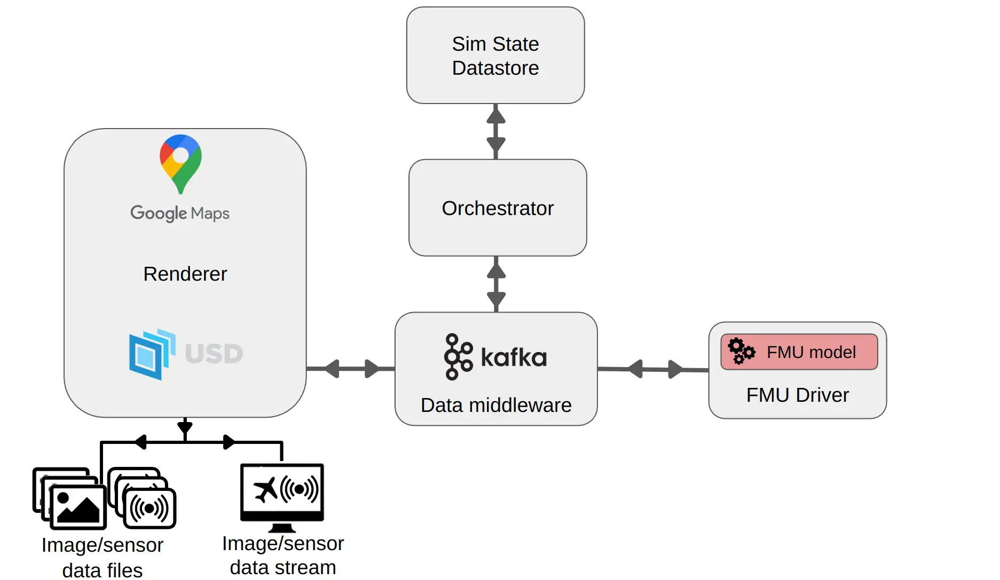

# AeroSim overview

This page gives a broad overview of AeroSim's software components and their functions.

- [**Software components**](#software-components)
  - [Data middleware](#data-middleware)
  - [Orchestrator](#orchestrator)
  - [Sim state datastore](#sim-state-datastore)
  - [FMU driver](#fmu-driver)
  - [Renderer](#renderer)
  - [Cesium](#cesium-plugin)

# Software components

AeroSim is designed as a modular system, emphasizing independence and interoperability between components. Different components communicate through standardised data formats, allowing new modules to be integrated or existing modules to be modified more easily.

### Data middleware

The data middleware facilitates high-throughput, low-latency data streaming between all components of the system. AeroSim is currently configured to use [Apache Kafka](https://kafka.apache.org/). Integration of the [Data Distribution Service](https://www.omg.org/omg-dds-portal/) (DDS) protocol is planned for the future.

### Orchestrator

The orchestrator coordinates the various elements of the simulator, governing the simulation clock and time-stepping, sending and receiving dynamics data from the FMU, sending information to the 3D rendering pipeline and communicating with machine learning infrastructure.

### Sim state datastore

The sim state datastore retains all information relevant to the simulation, including the scene graph, semantic data, actor poses and states and parent-child relationships.

### FMU driver

The FMU driver evaluates a [Functional Mock-up Unit (FMU)](fmu_overview.md) which defines the flight dynamics of a vehicle or other types of custom dynamic behaviour. The FMU must implement the [Functional Mock-up Interface](https://fmi-standard.org/) standard.

### Renderer

The rendering component simulates the interaction of the sensors with the 3D scene and produces realistic simulated sensor data. The output data is either fed to a stream for real-time playback or interaction with a simulation, or it is saved for later use in machine learning. AeroSim can be configured to use either the [Omniverse Kit App](https://docs.omniverse.nvidia.com/kit/docs/kit-app-template/latest/docs/intro.html) or the [Unreal Engine](https://www.unrealengine.com/en-US) to suit the application requirements.

### Cesium plugin

The Cesium plugin downloads 3D geospatial data from the [Cesium Ion web-service](https://cesium.com/platform/cesium-ion/). Using geospatial coordinates defined by the simulation configuration used by the orchestrator, the Cesium plugin downloads available geospatial maps derived from Google maps or Bing maps for use in the simulation, providing 3D environments based on real-world photogrammetry data.
