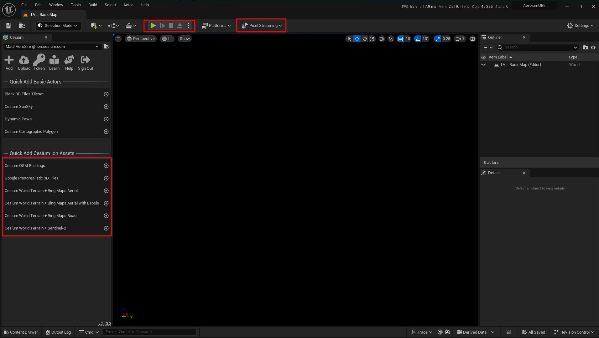
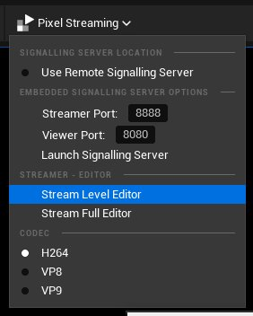
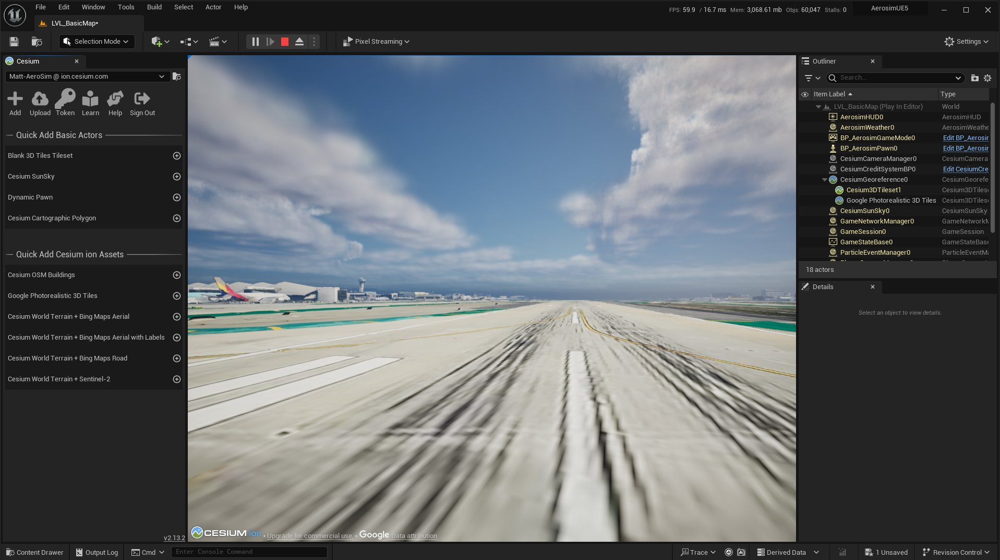

# Running AeroSim simulations

To run simulations in AeroSim, it is necessary to launch several components required by the simulator, prior to launching a simulation script:

- Renderer
- Kafka server
- Orchestrator
- FMU driver

AeroSim provides the `launch_aerosim.sh/bat` script to launch all required components together, there are several options depending upon the desired configuration:

- **--unreal**: launch the Unreal Engine renderer without the editor interface
- **--unreal-editor**: launch the Unreal Engine renderer with the editor interface
- **--unreal-editor-nogui**: launch the Unreal Engine with the editor but without a GUI (for pixel streaming the editor)
- **--omniverse**: launch the Omniverse RTX renderer with the editor interface
- **--pixel-streaming**: launch Unreal Engine or Omniverse with pixel streaming enabled
- **--pixel-streaming-ip**: set the IP address for the pixel stream (default `localhost` or `127.0.0.1`)
- **--pixel-streaming-port**: set the port for the pixel stream (default 80)
- **--help**: information about AeroSim launch options

### Unreal Engine

After launching the Unreal Engine editor, you should see the editor interface with a black viewport:



If you wish to use pixel streaming, open the _Pixel Streaming_ dropdown and choose _Stream Level Editor_.



Press the green play button in the editor to launch the simulation. You will now see the editor load a Cesium tile or asset:



The renderer is now ready to run a simulation. You can launch an AeroSim simulation using a Python launch script from the examples folder. Activate the AeroSim virtual environment and then launch the script with Python:

```sh
source .venv/bin/activate
cd examples/
# Windows .venv\Scripts\activate
# Windows cd examples

python first_flight.py
```

Once the simulation is finished, before relaunching the same simulation script (or a new one) it is necessary to stop and restart the simulation in the Unreal Engine editor using the transport controls to clear the scene.
