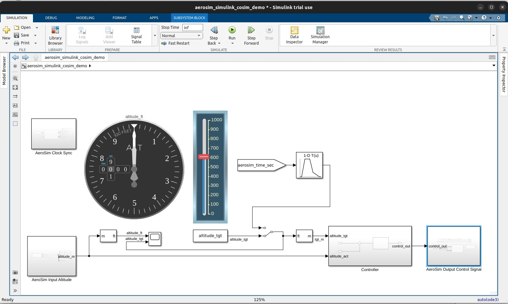
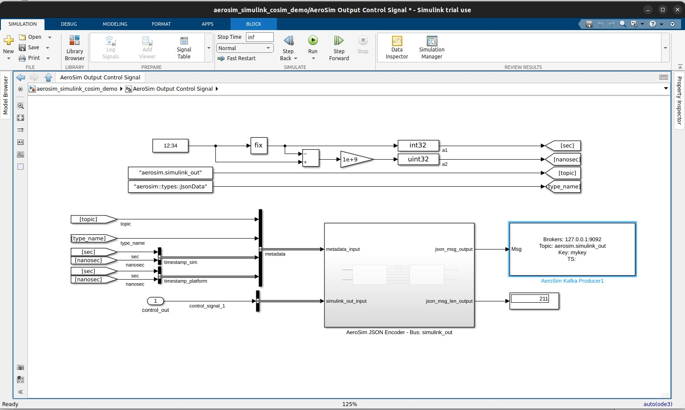
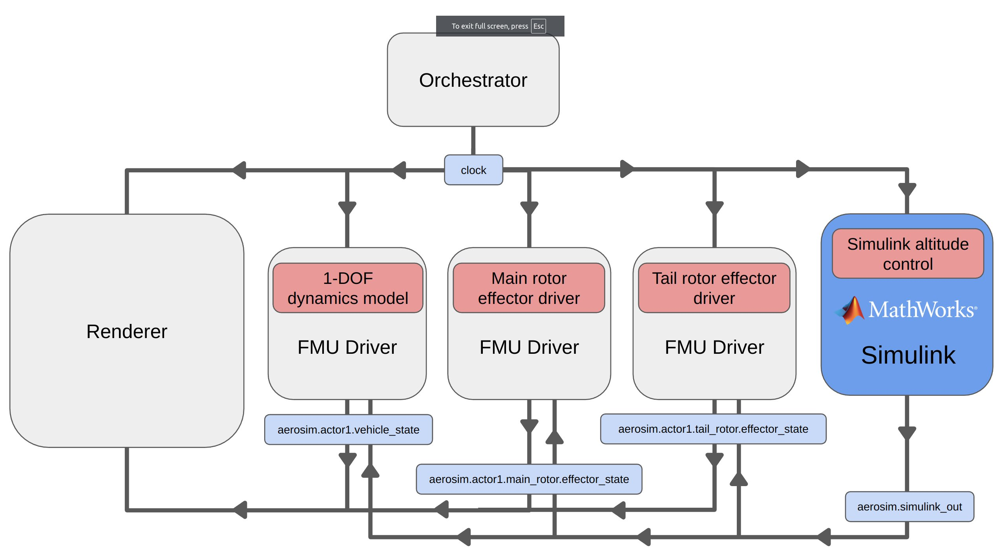

# Simulink integration

AeroSim provides a native Simulink integration enabling Simulink models to issue control inputs to the simulation directly from the Simulink runtime environment.

Compatible Simulink models can also be exported as FMUs through [Simulink's FMU export tool](https://www.mathworks.com/help/slcompiler/ug/simulinkfmuexample.html) and these can be used in AeroSim in the same way as standard FMUs made by other tools. Refer to the [FMU reference](fmu_reference.md) for details on how to use a standard FMU in AeroSim.

The Simulink runtime is integrated into AeroSim through the data middleware layer. Your Simulink model can communicate with AeroSim through topics pubhished by Kafka.

## Using the AeroSim-Simulink integration

Clone the aerosim-simulink repository into a new folder:

```sh
git clone https://github.com/aerosim-open/aerosim-simulink.git
```

Enter the repo and run the `init_submodules.sh/bat` script:

```sh
./init_submodules.sh # init_submodules.bat on Windows
```

Set up an environment variable named AEROSOM_SIMULINK_ROOT to identify the aerosim-simulink repository root. In Windows, use the environment variable dialogue found in the Start menu, you may want to add this line to `.bashrc` in Ubuntu:

```sh
export AEROSIM_SIMULINK_ROOT=/path/to/aerosim-simulink/
```

Then run the `build.sh/bat` script:

```sh
# build.bat on Windows
./build.sh
```

This builds the AeroSim Simulink blocks.

Open MATLAB and navigate to the aerosim-simulink repository directory. Open the `aerosim_simulink_cosim_demo.slx` Simulink model:



This Simulink model implements a simple target altitude control. The slider widget can be used when the model is running to set the target altitude, while the altimeter dial will show the altitude reached.

If you open the _AeroSim Output Control Signal_ block by double clicking it, you will see the _AeroSim Kafka Producer1_ and the _AeroSim JSON Encoder_. These blocks enable the Simulink model to communicate with AeroSim through Kafka topics.



Launch AeroSim using the `launch_aerosim.sh/bat` script and prepare the simulator. Open a terminal in the `examples/` directory of the AeroSim repository and activate the AeroSim virtual environment.

```sh
source .venv/bin/activate
cd examples/
# Windows .\.venv\Scripts\activate
# Windows cd .\tutorials\
```

Run the Simulink model from the Simulink toolbar and then shortly after the model is running, run the `simulink_cosim_and_fmu.py` example script from the terminal (the Simulink model will timeout after 30 seconds if it does not receive a connection from Kafka):

```sh
python simulink_cosim_and_fmu.py
```

Look at the Unreal Engine editor viewport and you will see a helicopter model. Move the slider widget in the Simulink model to set a target altitude. You will see the helicopter move upwards until it reaches the target altitude and then stabilize. The following diagram shows the data flow between the different modules of the Simulink co-sim configuration:



This example makes use of the `aerosim_simulink_fmu_1DOF_dynamics.fmu` FMU, which was exported from a Simulink model. You can examine the Simulink model that created it by opening the `aerosim_simulink_fmu_1DOF_dynamic.slx` model in Simulink. The FMU translates a single input, `fz` - the force applied on the Z axis into a 1-DOF dynamics model that applies the force to a mass under gravity, embedding the resulting Z position into a `vehicle_state` message format to send to the renderer.


Simulink models with compatible blocks can be [exported as FMUs](https://es.mathworks.com/help/slcompiler/ug/simulinkfmuexample.html) through the [FMU Builder for Simulink](https://www.mathworks.com/products/fmubuilder.html) toolbox. Install the FMU builder using the add-on manager and then open the _Save_ dropdown menu in the Simulink GUI. Select _Standalone FMU_ and choose the appropriate options in the FMU export dialogue. Some Simulink blocks may not be compatible with FMU export.
