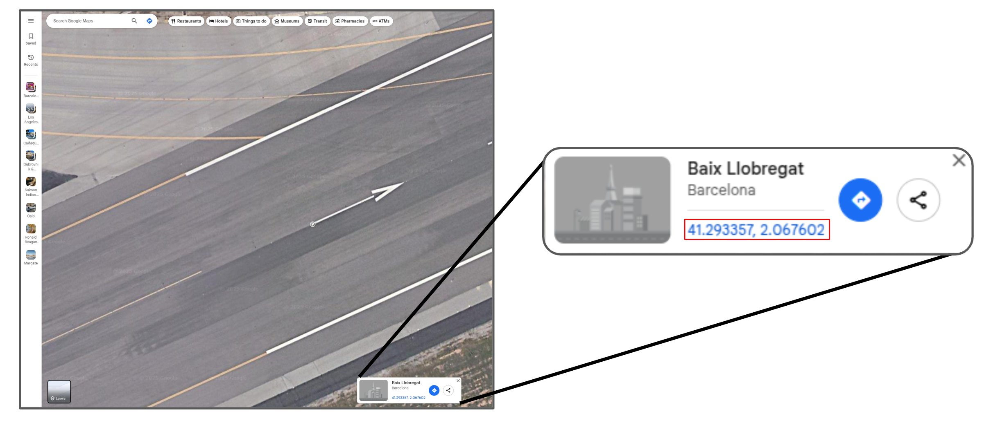
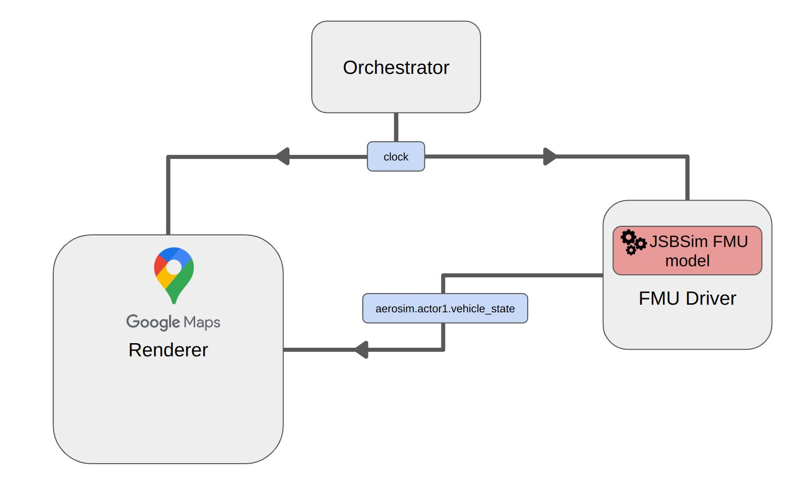
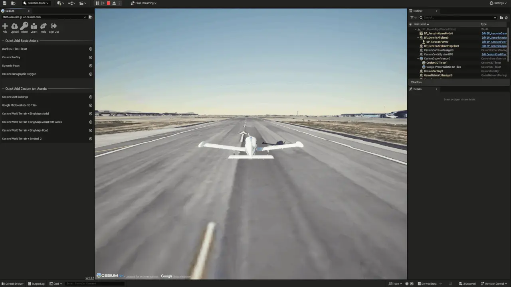

# Takeoff tutorial

This tutorial demonstrates how to set up a basic flight dynamics model with [JSBSim](https://jsbsim.sourceforge.net/) and set up a takeoff simulation at an airport of your choice.

In this tutorial you will learn to:

- Choose an airport on Google maps and retrieve the geospatial coordinates and runway heading
- Set up a simple flight dynamics model with JSBSim encapsulated in an FMU
- Set up AeroSim to simulate a takeoff from the chosen runway
  <br>

---

- [**Set up the script and configuration**](#set-up-the-script-and-configuration)
- [**Choose and airport**](#choose-an-airport)
- [**Set up a JSBSim flight dynamics module in an FMU**](#set-up-a-jsbsim-flight-dynamics-module-in-an-fmu)
  - [Imports](#imports)
  - [Variables](#variables)
  - [Initialization](#initialization)
  - [Translation of JSBSim data to AeroSim types](#translation-of-jsbsim-data-to-aerosim-types)
  - [Execute a simple takeoff procedure](#execute-a-simple-takeoff-procedure-in-the-do_step-method)
- [**Configuration file**](#configuration-file)
- [**Run the script**](#run-the-script)

---

## Set up the script and configuration

Open a new Python file named `run_takeoff_tutorial.py` to launch the simulation:

```py
from aerosim import AeroSim

json_config_file = "sim_config_takeoff_tutorial.json"

aerosim = AeroSim()
aerosim.run(json_config_file)

try:
    input("Simulation is running. Press any key to stop...")
except KeyboardInterrupt:
    print("Simulation stopped.")
finally:
    aerosim.stop()
```

Open a JSON file named `sim_config_takeoff_tutorial.json` for the configuration and add the skeleton structure:

```json
{
  "description": "Takeoff tutorial.",
  "clock": {
    "step_size_ms": 20,
    "pace_1x_scale": true
  },
  "orchestrator": {
    "sync_topics": []
  },
  "world": {
    "update_interval_ms": 20,
    "origin": {
      "latitude": 0.0,
      "longitude": 0.0,
      "altitude": 0.0
    },
    "actors": [],
    "sensor_setup": []
  },
  "renderers": [
    {
      "renderer_id": "0",
      "role": "primary",
      "sensors": []
    }
  ],
  "fmu_models": []
}
```

---

## Choose an airport

Firstly, we will choose an airport and record the latitude and longitude of the start and end of the runway. Click once with the left mouse button and then record the latitude and longitude given by the Google Maps user interface:



For this tutorial, we have chosen the runway at El Prat Airport in Barcelona, with the following runway coordinates:

- **Start**: 41.293357, 2.067602
- **End**: 41.305589, 2.103319

Enter the data into the [SunEarthTools website](https://www.sunearthtools.com/tools/distance.php) to calculate the heading of the runway. We will use the coordinates of the runway start to initialize the simulation in the configuration file, in the `origin` field of the `world` section:

```json

    ...

    "world": {
        "origin": {
            "latitude": 41.293357,
            "longitude": 2.067602,
            "altitude": 0.0
        },

    ...

```

---

## Set up a JSBSim flight dynamics module in an FMU

We will set up a simple flight dynamics model for a small fixed-wing aircraft in an FMU. Open a new Python file named `takeoff_fmu.py`.

### Imports

Firstly, let's import the external libraries and AeroSim components that we will need:

```py
from aerosim_core import (
    feet_to_meters,
    register_fmu3_var,
    register_fmu3_param,
    lla_to_ned,
)

from aerosim_data import types as aerosim_types
from aerosim_data import dict_to_namespace

import os
import numpy as np
import math
import jsbsim
from scipy.spatial.transform import Rotation

from pythonfmu3 import Fmi3Slave
```

### Variables

Next, we will inherit Fmi3Slave from PythonFMU3 and set up the instance variables and declare FMU variables. We add time as an independent variable and a `vehicle_state` variable derived from AeroSim types so that we can communicate the vehicle state to the renderer. Not that we also declare FMU parameters to allow us to specify the origin latitude, longitude and initial heading from the configuration file.

```py

...

class takeoff_fmu(Fmi3Slave):
    def __init__(self, **kwargs):
        super().__init__(**kwargs)

        self.jsbsim = None

        self.orig_lat = 0.0
        self.orig_lon = 0.0
        self.init_heading = 0

        register_fmu3_param(self, "orig_lat")
        register_fmu3_param(self, "orig_lon")
        register_fmu3_param(self, "init_heading")

        # FMU 3.0 requires a time variable set with independent causality
        self.time = 0.0
        register_fmu3_var(self, "time", causality="independent")

        # Define Aerosim interface output variables
        self.vehicle_state = dict_to_namespace(aerosim_types.VehicleState().to_dict())
        register_fmu3_var(self, "vehicle_state", causality="output")

    ...

```

### Initialization

Now in the `enter_initialization_mode` method, we will initialize JSBSim with the Cessna 172r model. We set initial conditions by targeting the `ic/` prefix of JSBSim's variable identifiers. Note that we set the altitude above ground level `ic/h-agl-ft` to zero to place the aircraft on the runway, we also set the initial velocity to zero and the latitude and longitude to that of the start of the chosen airport runway. Finally, we configure the aicraft for takeoff by setting the engine, brake and flaps parameters.

```py
    def enter_initialization_mode(self):

        self.jsbsim = jsbsim.FGFDMExec(jsbsim.get_default_root_dir())
        self.jsbsim.load_model('c172r')

        self.jsbsim['ic/h-sl-ft'] = 0      # Initial altitude (Sea Level)
        self.jsbsim['ic/u-fps'] = 0        # Initial velocity (Stationary)
        self.jsbsim['ic/vc-rad_sec'] = 0   # No initial pitch rotation

        self.jsbsim['ic/h-agl-ft'] = 4.43 # Wheels might be below ground, might want to let aircraft drop

        self.jsbsim['ic/lat-geod-deg'] = self.orig_lat  # Approximate latitude
        self.jsbsim['ic/long-gc-deg'] = self.orig_lon  # Approximate longitude
        self.jsbsim['ic/psi-true-deg'] = self.init_heading  # Facing East
        self.jsbsim['ic/gamma-deg'] = 0     # No initial climb angle
        self.jsbsim.run_ic()  # Apply initial conditions

        # Start the engine
        self.jsbsim[f"fcs/mixture-cmd-norm"] = 1.0
        self.jsbsim[f"fcs/advance-cmd-norm"] = 1.0
        self.jsbsim[f"propulsion/magneto_cmd"] = 3
        self.jsbsim[f"propulsion/starter_cmd"] = 1

        # Release the brakes and set flaps for takeoff
        self.jsbsim["fcs/center-brake-cmd-norm"] = 0
        self.jsbsim["fcs/left-brake-cmd-norm"] = 0
        self.jsbsim["fcs/right-brake-cmd-norm"] = 0
        self.jsbsim["fcs/flap-pos-deg"] = 25
```

### Translation of JSBSim data to AeroSim types

In order for the FMU to send data to the renderer in the appropriate format to control the aircraft's transform, we need to convert from JSBSim output data into the AeroSim `vehicle_state` datatype using the following class method:

```py

    ...

    def set_outputs_to_aerosim(self):
        if self.jsbsim is None:
            return

        # Set timestamp and frame_id
        timestamp = aerosim_types.TimeStamp.from_sec(self.time)
        self.vehicle_state.state.pose.header.stamp.sec = timestamp.sec
        self.vehicle_state.state.pose.header.stamp.nanosec = timestamp.nanosec
        self.vehicle_state.state.pose.header.frame_id = "world_ned"

        # Convert from Latitude, Longitude, Altitude to North, East, Down.
        ned = lla_to_ned(
            self.jsbsim["position/lat-geod-deg"],
            self.jsbsim["position/long-gc-deg"],
            self.jsbsim["position/h-sl-meters"],
            self.orig_lat,
            self.orig_lon,
            0.0,  # Use zero altitude as the origin for NED frame to output height as h-sl-meters
        )

        # Set position using NED coordinates
        self.vehicle_state.state.pose.position.x = ned[0]
        self.vehicle_state.state.pose.position.y = ned[1]
        self.vehicle_state.state.pose.position.z = ned[2]

        # Convert roll, pitch, yaw from JSBSim to quaternion and
        # set orientation
        roll = self.jsbsim["attitude/phi-rad"]
        pitch = self.jsbsim["attitude/theta-rad"]
        yaw = self.jsbsim["attitude/psi-rad"]
        two_pi = 2.0 * math.pi
        yaw = (yaw + two_pi) % two_pi  # Convert to 0-2pi range

        rotation = Rotation.from_euler("zyx", [roll, pitch, yaw])
        q_w, q_x, q_y, q_z = rotation.as_quat(scalar_first=True)
        self.vehicle_state.state.pose.orientation.w = q_w
        self.vehicle_state.state.pose.orientation.x = q_x
        self.vehicle_state.state.pose.orientation.y = q_y
        self.vehicle_state.state.pose.orientation.z = q_z

        # Set linear velocity
        self.vehicle_state.velocity.x = feet_to_meters(self.jsbsim["velocities/u-fps"])
        self.vehicle_state.velocity.y = feet_to_meters(self.jsbsim["velocities/v-fps"])
        self.vehicle_state.velocity.z = feet_to_meters(self.jsbsim["velocities/w-fps"])

        # Set angular velocity
        self.vehicle_state.angular_velocity.x = self.jsbsim["velocities/p-rad_sec"]
        self.vehicle_state.angular_velocity.y = self.jsbsim["velocities/q-rad_sec"]
        self.vehicle_state.angular_velocity.z = self.jsbsim["velocities/r-rad_sec"]

        # Set linear acceleration
        self.vehicle_state.acceleration.x = feet_to_meters(
            self.jsbsim["accelerations/udot-ft_sec2"]
        )
        self.vehicle_state.acceleration.y = feet_to_meters(
            self.jsbsim["accelerations/vdot-ft_sec2"]
        )
        self.vehicle_state.acceleration.z = feet_to_meters(
            self.jsbsim["accelerations/wdot-ft_sec2"]
        )

        # Set angular acceleration
        self.vehicle_state.angular_acceleration.x = self.jsbsim[
            "accelerations/pdot-rad_sec2"
        ]
        self.vehicle_state.angular_acceleration.y = self.jsbsim[
            "accelerations/qdot-rad_sec2"
        ]
        self.vehicle_state.angular_acceleration.z = self.jsbsim[
            "accelerations/rdot-rad_sec2"
        ]

    ...

```

### Altitude hold

We need a simple controller utility function to target a specified altitude.

```py

    ...

    def hold_altitude(self, target_altitude, target_speed):

        # # PID Controller Parameters
        Kp = 0.005  # Proportional gain
        Kp_throttle = 0.01  # Proportional gain
        Ki = 0.0001  # Integral gain
        Kd = 0.01  # Derivative gain

        current_altitude = self.jsbsim['position/h-agl-ft']
        current_speed = self.jsbsim['velocities/vc-kts']

        # Compute altitude error
        altitude_error = target_altitude - current_altitude

        # Adjust elevator
        elevator_command = Kp * altitude_error
        elevator_command = max(-0.1, min(0.1, elevator_command))
        self.jsbsim['fcs/elevator-cmd-norm'] = - elevator_command

        # Adjust throttle based on airspeed
        speed_error = target_speed - current_speed
        throttle_command = 0.75 + Kp_throttle * speed_error  # Base throttle + correction
        throttle_command = max(0, min(1, throttle_command))  # Limit between 0 and 1
        self.jsbsim['fcs/throttle-cmd-norm'] = throttle_command

    ...

```

### Execute a simple takeoff procedure in the do_step(...) method

In the do step method, we will set the throttle to full power which will start moving the aircraft down the runway. After 30 seconds, once the aircraft has gathered enough speed, we will apply a command to raise the elevators, raising the nose and lifting the aircraft off the ground. We also apply small aileron control commands to counter any roll that occurs, to keep the wings level during takeoff and flight.

```py
    def do_step(self, current_time: float, step_size: float) -> bool:

        # Do time step calcs
        step_ok = True
        end_time = current_time + step_size
        self.time = self.jsbsim.get_sim_time()

        self.jsbsim['fcs/throttle-cmd-norm'] = 1.0

        # Keep the wings level
        self.jsbsim['fcs/aileron-cmd-norm'] = - 5.0 * self.jsbsim['attitude/roll-rad']


        if self.jsbsim['position/h-agl-ft'] > 50:
            # Above 50 feet, hold altitude
            self.hold_altitude(100, 80)
        elif self.jsbsim['velocities/vc-kts'] > 65:
            # Once takeoff speed is reached, rotate
            self.jsbsim["fcs/elevator-cmd-norm"] = -0.3

        self.jsbsim.run()

        print(f"JSB Time: {self.jsbsim.get_sim_time():.2f},
                Vcal: {self.jsbsim['velocities/vc-kts']:.2f},
                Alt: {self.jsbsim['position/h-agl-ft']:.2f} ft,
                Throttle: {self.jsbsim['fcs/throttle-cmd-norm'] :.2f},
                Elv: {self.jsbsim['fcs/elevator-cmd-norm'] :.2f}")

        # Set the vehicle_state variable
        self.set_outputs_to_aerosim()

        return True
```

Lastly, build the FMU using PythonFMU3:

```sh
pythonfmu3 build -f takeoff_fmu.fmu
```

---

## Configuration file

Now we add one actor to the configuration file. The AeroSim component configuration has the following setup:



Set the `type` field set as `airplane` and the `usd` field set as `generic_aircraft.usd`. In the `fmu_models` field add a list item with `id` as `takeoff_fmu` and `fmu_model_path` set as `fmu/takeoff_fmu.fmu`. Add an item to the `component_output_topics` list with `"msg_type": "vehicle_state"` and `"topic": "aerosim.actor1.vehicle_state"`.

```json
{
  "description": "Takeoff tutorial.",
  "clock": {
    "step_size_ms": 20,
    "pace_1x_scale": true
  },
  "orchestrator": {
    "sync_topics": [
      {
        "topic": "aerosim.actor1.vehicle_state",
        "interval_ms": 20
      }
    ]
  },
  "world": {
    "update_interval_ms": 20,
    "origin": {
      "latitude": 41.293222,
      "longitude": 2.067261,
      "altitude": 51
    },
    "weather": {
      "preset": "Cloudy"
    },
    "actors": [
      {
        "actor_name": "actor1",
        "actor_asset": "vehicles/generic_airplane/generic_airplane",
        "parent": "",
        "description": "Generic aircraft model",
        "transform": {
          "position": [0.0, 0.0, 0.0],
          "rotation": [0.0, 0.0, 66.5],
          "scale": [1.0, 1.0, 1.0]
        },
        "state": {
          "msg_type": "aerosim::types::VehicleState",
          "topic": "aerosim.actor1.vehicle_state"
        },
        "effectors": [
          {
            "id": "propeller_front",
            "relative_path": "generic_airplane/propeller",
            "transform": {
              "translation": [0.0, 0.0, 0.0],
              "rotation": [0.0, 0.0, 0.0],
              "scale": [1.0, 1.0, 1.0]
            },
            "state": {
              "msg_type": "aerosim::types::EffectorState",
              "topic": "aerosim.actor1.propeller.effector_state"
            }
          }
        ]
      }
    ],
    "sensors": [
      {
        "sensor_name": "rgb_camera_0",
        "type": "sensors/cameras/rgb_camera",
        "parent": "actor1",
        "transform": {
          "translation": [-20.0, 0.0, -5.0],
          "rotation": [0.0, -10.0, 0.0]
        },
        "parameters": {
          "resolution": [1920, 1080],
          "tick_rate": 0.02,
          "frame_rate": 30,
          "fov": 90,
          "near_clip": 0.1,
          "far_clip": 1000.0,
          "capture_enabled": false
        }
      }
    ]
  },
  "renderers": [
    {
      "renderer_id": "0",
      "role": "primary",
      "sensors": ["rgb_camera_0"],
      "viewport_config": {
        "active_camera": "rgb_camera_0"
      }
    }
  ],
  "fmu_models": [
    {
      "id": "takeoff_fmu",
      "fmu_model_path": "fmu/takeoff_fmu.fmu",
      "component_input_topics": [],
      "component_output_topics": [
        {
          "msg_type": "vehicle_state",
          "topic": "aerosim.actor1.vehicle_state"
        }
      ],
      "fmu_aux_input_mapping": {},
      "fmu_aux_output_mapping": {},
      "fmu_initial_vals": {
        "orig_lat": 41.293222,
        "orig_lon": 2.067261,
        "init_heading": 67
      }
    }
  ]
}
```

---

## Run the script

Now from the `tutorials` directory, run the Python script to execute the simulation:

```sh
source .venv/bin/activate
cd tutorials/
# Windows .\.venv\Scripts\activate
# Windows cd .\tutorials\

python run_takeoff_tutorial.py
```


