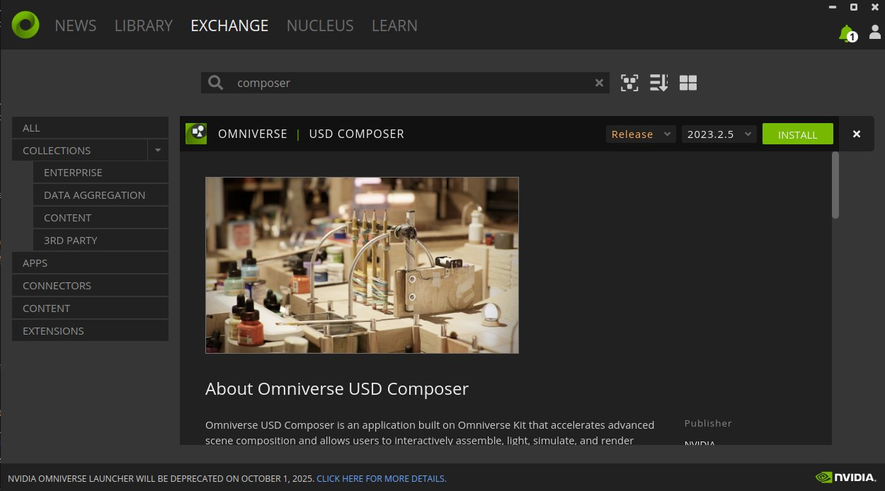
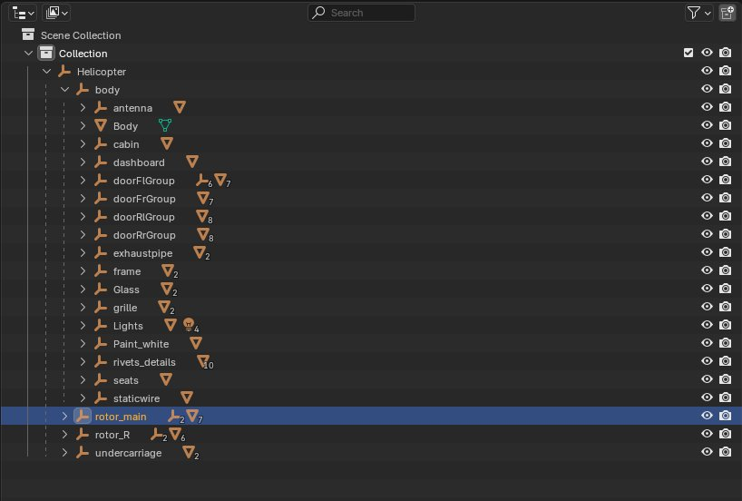
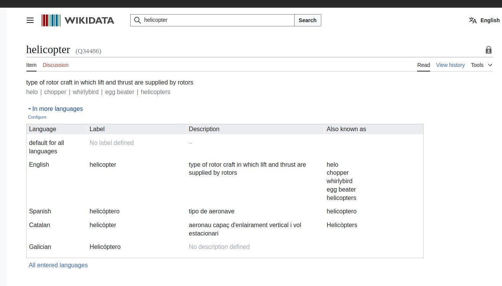
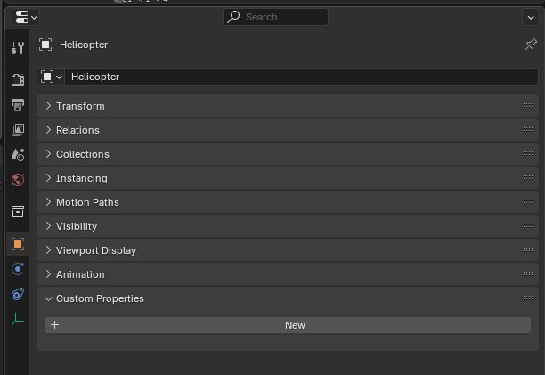
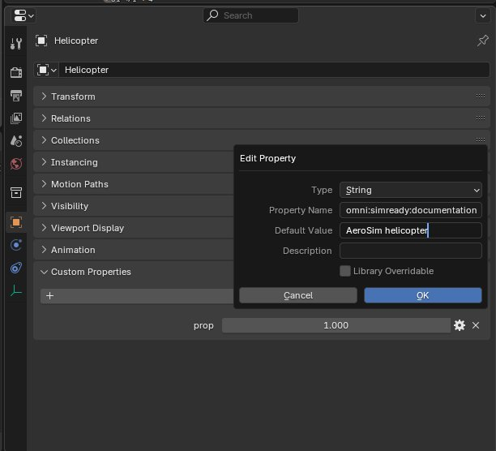
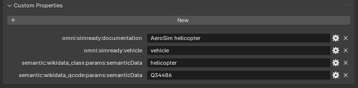
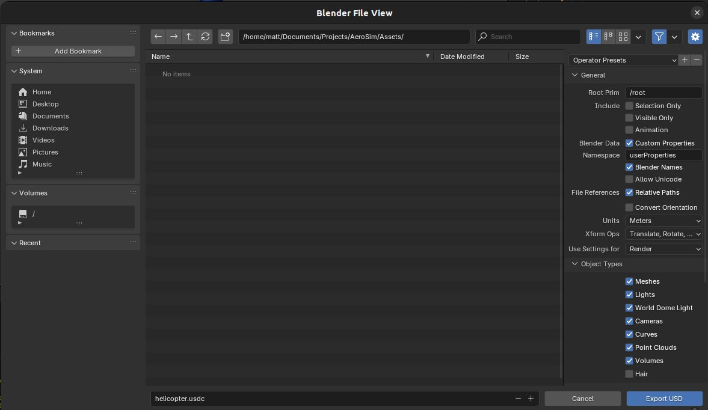
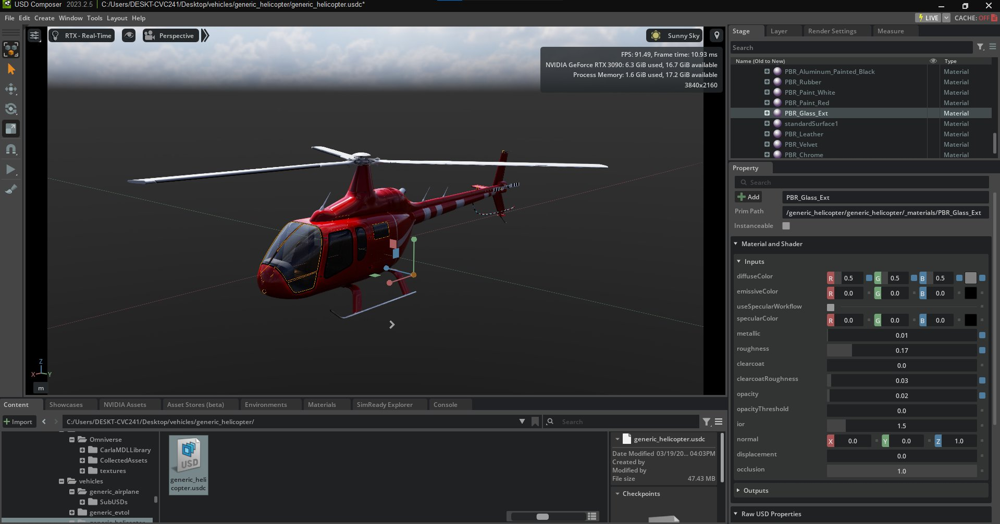
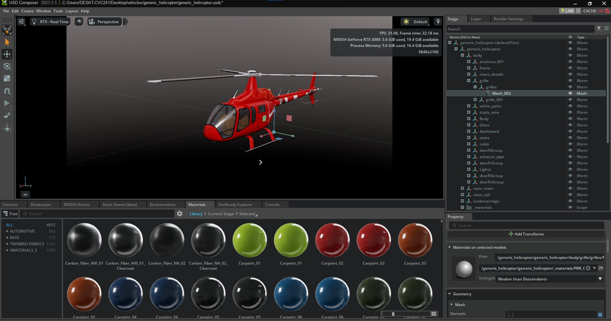

# USD asset creation pipeline

The following details how to prepare a vehicle asset for export into the [Universal Scene Description (USD)](https://openusd.org/release/index.html) format and import into AeroSim.

3D modelling a complex object such as an aircraft requires a significant degree of knowledge about modelling techniques and software, therefore, if you do not have previous experience in using these applications, we suggest you refer to educational or training materials for 3D modelling prior to attempting this procedure.

In this guide, we will use Blender, since it is a free, open-source 3D modelling tool with all the functionality needed to prepare a model for import into AeroSim. For preparing USD assets, it is also useful to install the [Omniverse USD composer from NVIDIA](https://developer.nvidia.com/omniverse?sortBy=developer_learning_library%2Fsort%2Ffeatured_in.omniverse%3Adesc%2Ctitle%3Aasc#section-getting-started). Download the Omniverse Launcher for your OS and then execute the launcher and follow the installation instructions. You will need an Omniverse account, if you don't already have one, follow the link in the Omniverse Launcher to create a new account. After launching Omniverse go to the exchange tab and search for the Omniverse USD Composer.



## Model organization

The model should be organized in such a way that all large components of the vehicle are separated into different objects. A rule of thumb would be to separate any large component you might expect to move significantly during normal operation of the vehicle and separate components that are likely to have very different material properties e.g. metalwork vs glass. With the components as separate objects

For example, the following is an example of an appropriate hierarchy for a helicopter model:

- Body:
  - Metal fuselage and bodywork
  - Interior: seats, fittings and flight control panel
  - Left front door
  - Right front door
  - Left rear door
  - Right rear door
  - Glass
- Main rotor
- Rear rotor
- Undercarriage

In order to comply with the standard USD model organization, each separate mesh component of the model should be parented to an _empty_ in Blender. The entire model hierarchy should also grow from a _root empty_ placed at the root of the model hierarchy. Each sub-component of the model (e.g. fuselage, doors, rotors) should have its own empty which is a child of the root empty. Each sub-component's mesh object should be a child of its corresponding empty object.

For non-rotating components, the empty should be placed at a sensible location, for example, where you might expect the center of mass of the object to be. For rotating components, the empty should be placed at the expected rotation center of an object. For example, for a rotor, the empty should be placed along the axis of rotation, close to the geometric center of the object. This is an important procedure to follow for preparing SimReady content, since semantic labels will be applied to the empty components, not to meshes.

To parent a mesh object to an empty in Blender, select the mesh object in the 3D vieport or outliner panel. Holding `Shift`, select the target empty, it is important that the intended parent is the last object selected. Then, press `Ctrl + P` and choose _object_ from the dropdown menu. You can also establish parent relationships directly in the outliner. To do so, click and hold the child item (the mesh) in the outliner panel and drag it over the parent item (the target empty), ensuring that the parent item is highlighted. Release the mouse button and you will see the child mesh get nested under the parent empty in the outliner view.

The following image shows an example hierarchy of a helicopter model organized in Blender:



## Materials

USD supports a subset of the material functionality Blender provides. To ensure Blender model materials are compatible with the USD standard, use the Principled BSDF for all materials. For transparent materials like glass and perspex, adjust the alpha parameter and transmission parameter to achieve the desired appearance. USD supports the standard texture node with UV mapping in Blender. It is recommended to limit materials to this base set of material node types. Other node types may not be supported. If you require more material node types in Blender for your aims, ensure to [inspect the model in the Omniverse USD Composer](#inspecting-the-model-in-omniverse-usd-composer) to confirm the node's effect can be observed after export.

The following material node types are known to be supported by Blender's USD export:

- Principled BSDF
- Image Texture
- Combine Color
- Separate Color
- Normal/Map
- Multiply

Materials can be adjusted or replaced in the Omniverse USD Composer if needed. The USD composer also provides a comprehensive library of USD compatible materials to use.

## Semantic labelling and Q codes

To comply with the SimReady content standard and facilitate proper semantic labelling in simulation, the vehicle model and/or its subcomponents should have custom properties that identify the proper semantic label and Q-code as defined in the [Wikidata](https://www.wikidata.org/wiki/Wikidata:Main_Page) database. The Wikidata database is a structured knowledge base that standardizes semantic labels and Q-codes and serves as a universally recognized reference for semantic identification.

To add semantic labels to the model for SimReady preparation, first, look up the appropriate item in the Wikidata database search bar. In this example case, we will look for the label and Q-code for helicopter.



Wikidata shows us that the appropriate semantic label is _helicopter_ in lower case and the corresponding Q-code is _Q34486_. We now add these labels to custom properties of the root empty object in the example helicopter model. With the root empty of the model selected open the _Properties_ panel in Blender.



Add a new custom property, select the _String_ type, name the property as `omni:simready:documnetation` and set the value as `AeroSim helicopter`. The specific entry for this variable is optional and can be set to suit your naming preference.



After this, add three more custom properties with the appropriate semantic label and Q-code derived from Wikidata:

- Name: `omni:simready:vehicle`, value: `vehicle`
- Name: `semantic:wikidata_class:params:semanticData`, value: `helicopter`
- Name: `semantic:wikidata_qcode:params:semanticData`, value: `Q34486`



Adding these properties to the model ensures that the model will be correctly semantically labelled within a simulation.

## Exporting the model to USD

To export the finished model from Blender, go to `File > Export`. From the drop-down menu choose Universal Scene Description (.usd\*) to open the USD export dialogue.



Ensure that _Selection Only_, _Visible Only_ and _Animation_ are unchecked. In the _Root Prim_ field put the name of the root empty of your model with a leading forward slash e.g. `/Helicopter`.

You may also find it convenient to use the script editor to export. Oment the script editor and add the following code, adjusting the `filepath` and `root_prim_path` parameters accordingly:

```py
bpy.ops.wm.usd_export(
    filepath="/path/to/output/file",
    selected_objects_only=False,
    visible_objects_only=False,
    convert_world_material=False,
    root_prim_path="/Helicopter",
    author_blender_name=False,
)
```

## Inspecting the model in Omniverse USD composer

Open the Omniverse USD Composer using the Omniverse launcher and open the USD file exported from Blender.


There are several things to check about the model in USD composer:

- Hierarchy: on the right hand side in the _Stage_ panel, check that the model hierarchy is correct.
- Labels:
  - Select the root prim and inspect the _Raw USD Properties_ section in the _Property_ panel
  - Check that the Wikidata class and Q-code are correct
- Root transform: with the root prim selected look at the _Transform_ in the _Property_ panel:
  - If there is no transform, add the default one
  - If there is a transform, ensure that Translate and Rotate are all zeroed and that all Scale is 1.0 on all axes
  - If the transform is incorrect, check the model in Blender and export again
- Sub-component transforms:
  - Click on a sub-component in the _Stage_ panel
  - Reference the blender model to ensure the sub-component transform is as expected
  - Visualy inspect the sub-component root in the 3D view
- Ensure that the model has the correct dimensions:
  - Choose the measure tool from the `Tools > Measure` dropdown
  - Click on two vertices on opposing sides of the model and ensure they show the expected distance
- Inspect the material properties in the 3D view for anomalies or deviations
  - If a material looks odd, click on the component in the 3D view and inspect the _Material_ section of the _Property_ panel
  - Adjust the parameters accordingly
  - Transparent components like glass may need opacity adjustment



- You may also wish to use materials from the Omniverse library. Drag and drop the material onto a part of the model in the 3D view from the _Materials_ panel of the content browser:



### Exporting the model from USD composer

Once you are satisfied with the appearance of the model, export it from the file menu with `File > Collect as`. Check _Flat Collection_ and choose a directory location for the files. This will export a directory, inside of which will be the root USD file, acompanied by a directory named _SubUSDs_. Move this entire directory and its contents into the appropriate location in the `aerosim-assets` repository, e.g. the `vehicle` directory.

Once placed into the `aerosim-assets` repository directory, the model will be accessible in the AeroSim config using the `actor_asset` field of the `actor` section of the simulation configuration JSON file:

```json

    ...

    "actors": [
    {
        "actor_name": "actor1",
        "actor_asset": "vehicles/generic_helicopter/generic_helicopter",
        "parent": "",
        "description": "Generic helicopter",

    ...

    }
}
```

Any effectors that are part of the model as sub-components can be accessec through their relative position in the hierarchy:

```json

    ...

        "effectors": [
            {
                "id": "rotor_main",
                "relative_path": "generic_helicopter/rotor_main",

    ...

    }
}
```
